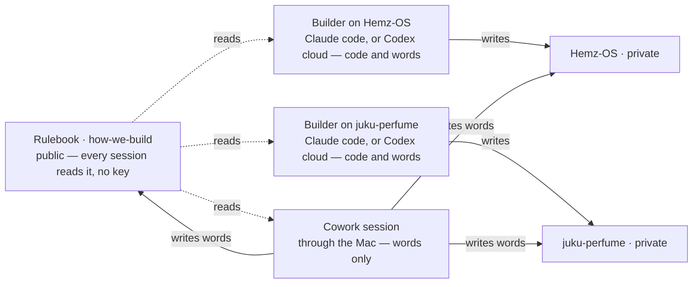

# how-we-build

The rulebook for every product Dhayan's AI studio builds. This repository says **how** we work. Each product's own repository says **what** we build.

**Two files matter.**

- `HOW-WE-BUILD.md` — the operating page, short and machine-checked; the cap lives in `check.sh`. The first thing a working session loads, with *What every product carries* below.
- `CHARTER.md` — the Systems Blueprint, the reasoning behind the page. Read once, never loaded into a working session.

A third, `AGENTS.md`, is not for sessions at all: it carries the reviewer's brief for changes to this repository, because the reviewing tool loads only a file of that name.

**Why it is public.** It holds no secrets, prices or customer data — only the way we work — and a public repository is the one thing every session, in either stack, can read directly, with no extra setup. Product repositories stay private.

## Products under this rulebook

The whole map: what exists, where it lives, one line on what it is for, and the file to open first. It is a directory board, not a summary — nothing here says more about a product than its one line.

- **Juku Perfume** — `https://github.com/Adonis80/juku-perfume` (private). A fragrance intelligence and exchange platform: a Personal Nose that learns a person's taste, samples picked for them, and the value sitting on collectors' shelves. Open `AGENTS.md`, then `PRODUCT.md`, then `roadmap.json`.
- **Hemz OS** — `https://github.com/Adonis80/Hemz-OS` (private). The operating system for an alterations business, grown out of Alma's Alterations in Brighton. Open `AGENTS.md`, then `PRODUCT.md`, then `roadmap.json`.

A repository not listed here is not under this rulebook.

**Which repository a chat Project reads (the Chairman's ruling, 11 September 2026).** The Juku OS Project — the chat Project named for this system — reads this repository and uses the map above as the whole register of what exists, opening a product repository only when it needs live detail. The Hemz OS Project reads `Adonis80/Hemz-OS` plus the global rules here; the Juku Perfume Project reads `Adonis80/juku-perfume` plus the same. This is where to read, not permission to read: each Project's own GitHub connection is proved by fetching live commits and open pull requests from inside that Project, because a successful read somewhere else proves nothing for it. Reuse this register; never start a second map.

## How a product joins

1. Its repository's `AGENTS.md` begins with one line: `Rulebook: https://github.com/Adonis80/how-we-build — read HOW-WE-BUILD.md before anything else, then What every product carries in its README.` Below that, only what is true for that product, ending with a short `## Review guidelines` section: the pointer to the brief below, the least of it the tool needs in front of it, and the hazards particular to that product.
2. Each provider/account Project uses the template below, blanks filled; reuse an existing Project where one exists.
3. One line in *Products under this rulebook* above.
4. Code review switched on for the repository in Codex — the Chairman's tap. That is the whole setup.

**Nothing is copied into a provider Project's stored sources — not the rulebook, not product files.** A stored copy becomes stale when GitHub changes. Each session reads the public rulebook and permitted private product repository live through its available connector or attached checkout. A Project holds its short routing instructions and no files (the Chairman's ruling, 6 September 2026). Separate accounts authenticate and prove access independently; seeing a Project name or reading one repository does not prove branch or pull-request writes.

### Project instructions template

```text
# <Product> — how this Project works

Rulebook: https://github.com/Adonis80/how-we-build. At every session start, read
HOW-WE-BUILD.md live, then README's "What every product carries". Nothing here
overrides merged rules; open proposals and prior chats are context, not policy.

This Project builds <Product>. Canonical repository:
https://github.com/Adonis80/<repo> (private). Read its AGENTS.md, relevant PRODUCT.md
and roadmap.json, then current open pull requests before selecting work.

GitHub and the pull request are the handover. Treat Project memory, cached files and
chat summaries as non-authoritative. Verify the tools actually available: repository
read, execution, branch push and pull-request updates are separate capabilities. A
capable Work, Codex or Claude session acts as CTO and completes authorised work; a
session missing a capability reports the exact blocker and never invents state.

For build, resume the approved checkpoint before another slice. One lead owns it; work
on a branch, never directly on main, and keep objective, checks, remaining work, head
commit and next action current in the pull request. Make technical decisions. Ask
Dhayan only for money, permissions, product truth, material visual acceptance or an
irreversible action.

Use mode 2 by default: short summary and actions, with no technical-choice questions.
Use mode 1 only when Dhayan requests dialogue with Claude: return only a downloadable
Markdown reply until consensus. Product decisions go in PRODUCT.md or roadmap.json;
these instructions hold no product state or files.
```

## The independent reviewer

Step 5 of the loop — an independent reviewer reads every pull request cold — is done by the other stack. Today that is Codex on GitHub, reading Claude's work in every repository under this rulebook; where the list below requires it the other way round, a Claude session reads OpenAI's. It reviews the *change*: the diff, the tests, what regressed, and whether the pull request's claims match its code. It does not challenge a design; that is the consultant's lane below. Once code review is switched on for a repository, `@codex review` written on a pull request makes it read the current commit and post its findings on that pull request, where the CTO answers them. Nothing is pasted between models, and nothing passes through the Chairman. It is one reviewer for every repository under this rulebook, this one included — which is why this repository, though not a product, carries an `AGENTS.md` of its own. Which repositories it can reach is decided by the GitHub app's repository access, set once for all of them; no other setup is needed.

**Cold, and cross-vendor where it counts.** Independent means a fresh session forming its view from the diff and tests before the PR account. Another vendor is required for pricing logic, live database mutation or schema, authentication and authorisation, public trust-boundary changes, deploy and release machinery, and this review gate; unsure means crossed. A capable lead from either stack may implement, but the required other-vendor review must be posted or linked on the PR before merge. If no direct review route exists, that class does not start. Dhayan is not the message relay.

`check.sh` can verify one machine identity today: a submitted Codex review receipt for the exact current head. That receipt proves a read, not approval, resolution of findings or cross-vendor review. The PR separately records `Lead stack:` and `Reviewed by:`. Never manufacture a reviewer identity or treat the builder's self-review as independent.

**A review clears only the commit it read.** A later push voids it: a round's fixes land as one push and the CTO asks once, and the repository's check goes green only when the reviewer has read the current commit — by itself when the reviewer posts findings, and equally when it answers a clean pass as a plain comment naming the commit — both shapes count (fixed 9 September, after a clean pass left a pull request red overnight). A report to the Chairman names the commit that was reviewed.

**The session asks once and stops; two rounds is the limit for the CTO too.** After a push, ask once and stop. Batch each round's fixes into one push. After round two, a known blocking finding parks or shrinks the slice; it never merges. Tested nonblocking dissent may remain visible on the PR. A third round means the slice is too large, so ship only a smaller independently proved part. Dhayan receives the preview, outcome and any decision genuinely his, never an idle status report.

**The reviewer's budget is finite and shared.** One allowance serves every repository under this rulebook: spent on one product, it is spent for all, and a words-only pull request draws on the same pool. That is why the ask comes once per round, with the round's fixes batched into one push — an ask per small push reads the same code many times over and empties the allowance. Learned the expensive way on 9 September: nine asks on nine small pushes to one Juku Perfume pull request ended reviews by mid-afternoon, and within minutes the same wall refused Hemz OS on two pull requests — the same failure, twice, in two products, which is what clears the charter's gate for this rule.

**When the reviewer is unavailable** — allowance spent, or the service down — the gate does not open and is not waived. The slice parks: one comment on the pull request names the blocker, then no further pushes and no further asks, which only deepen the hole. Nothing watches for the reviewer's return, on any clock: a watch cannot see it, since only an ask can tell and a parked slice makes none. The return is found by the next session to start, whose ask on the oldest parked pull request either lands or is refused. Parked work never stops the line: the next slice starts from `main` in its own session — but `main` still names the parked slice as the top roadmap item, so a session starting on *build* alone would rebuild it. When the reviewer returns, parked pull requests re-enter review oldest first, one ask each. None of this reaches the Chairman: a parked slice is the CTO's wait, not his problem, and he hears of it only when it moves something he was promised.

**A change here reaches a session at its start, never mid-flight.** A running session keeps the page it read when it began, so a rule landed at noon does not bind a session that started at eleven. Nothing is done about this: a session that re-read its rules mid-slice would be a session whose ground moved under it. The consequence is only that a new rule shows up in the next session, not the one in front of you.

Codex takes its brief from the repository's own `AGENTS.md`. The brief lives here, once. A pointer alone was tried on two real reviews and the marks of the brief vanished from them — no addressee, no account of what was checked, no confidence — while a review with the brief in front of it carried all three. So a product's `AGENTS.md` ends with a short `## Review guidelines` section: the pointer here, the least of the brief the tool needs in front of it, and the hazards particular to that product. Those few lines are a copy, kept only because the tool cannot follow a link, and they change only when this brief does.

```
## Review guidelines
- Cold read: form your view from the diff, the tests, `PRODUCT.md` and `roadmap.json` first, and read the pull request's own account last. Never inherit the author's conclusions.
- Look for what is wrong, missing, duplicated, untested, or quietly wider than the slice. Say what you checked and what you did not, and how sure you are. Do not manufacture disagreement.
- Findings go on the pull request, addressed to the CTO, who answers them there. Two rounds at most. A tested nonblocking trade-off is the CTO's call with dissent visible; a blocking or unsafe finding parks or shrinks the change. Product truth goes to the Chairman as "Decision needed: …".
- A review clears only the commit it read; a later push voids it.
- Plain English. Never write a file into the repository.
```

## The consultant

The consultant is a fresh chat in the stack that is not leading — ChatGPT while Claude leads, Claude while OpenAI leads — used on demand for architecture, product intelligence, research, model design, patterns or disagreement. It reads GitHub live and addresses the CTO. For a pull-request review it posts directly on that PR through its authorised route, where the CTO answers; Dhayan does not carry the exchange. If no direct route exists, the required class does not start. It explains the system when Dhayan asks and is not a daily narrator. The standing instructions below are pasted once into that model's settings and written by role, so the same text serves either stack; product state stays in GitHub.

```
You are the consultant to Dhayan's AI studio, which builds software under a public rulebook:
https://github.com/Adonis80/how-we-build. GitHub is the only truth; nothing you
remember about a product's state is. Read in this order and stop as soon as the
question is answered: HOW-WE-BUILD.md, and the README's map if the product is not
obvious; the product's AGENTS.md; the pull request or diff in question; the passages
of PRODUCT.md and roadmap.json the question touches — the whole of PRODUCT.md only
when the question spans the product. The lead — the model he started with *build* — is CTO and builds;
you challenge, on demand: architecture, product intelligence, research, model design, patterns across
products, disagreement with the CTO. When authorised, post review findings directly
on the pull request. Address them to the CTO by name, most serious first, each with
what is wrong, what you would do instead, and confidence; say what you did not check;
do not manufacture disagreement or inherit the CTO's conclusions. Dhayan is not technical: when he asks, explain from first
principles in plain adult English, with an everyday analogy where it helps and a
box-and-arrow drawing where it materially helps, and end with three plain lines for
him. Prefer a fresh conversation for each substantial question, and end one when the bounded
question is settled, when the next turn is materially a new question, or when reloading the
small source set would be cheaper and clearer than carrying the thread.
```

## Session changeover

His ruling, 10 September 2026: at every turn, weigh whether it is cheaper to stay in this session or start a fresh one, and when starting fresh, leave the next session what it needs. What follows is that ruling, worked out with the consultant and written down.

At every turn, decide whether the next turn stays here or starts fresh. Stay only while all three hold:

- **Same work:** the same slice or bounded question continues.
- **Cheaper to stay:** the useful unresolved context here costs less than rebuilding it from the small canonical boot.
- **Clear:** the history still helps more than it hurts, with no material stale truth, contradiction, looping, irrelevant output or lost detail.

Otherwise, checkpoint and start fresh. Provider caches and compaction can inform that judgement but are never rules in themselves.

Before leaving, put every durable fact in GitHub and make the pull request and roadmap handover sufficient on their own. If the opening words for the next session would have to carry project state, the handover is not finished. Advisory work that has no repository yet gets one temporary `START-HERE.md` — the bounded question, what is agreed, the next action, the files that matter — superseded the moment the result lands in GitHub.

A fresh session reads progressively from canonical truth and stops when it knows enough. It never rebuilds repository state from old chats. Keep tool output targeted, and never poll. For Codex, a fresh task starts each slice and a thread is continued only inside that slice, while the three above hold.

## The two stacks

One lead owns a slice at a time. The pull request is the handover, and a replacement lead rebuilds what it needs from GitHub, never from a chat. At a clean checkpoint, *build* in the other stack transfers ownership — and only then: ownership moves when the pull request's latest entry is the outgoing lead's checkpoint. Otherwise the incoming lead leaves that pull request alone and takes the next item. Nothing is built to manage this: no switch file, no lock service, no registry, no orchestrator.

**Anthropic.** Use a Claude surface only after verifying its repository, execution, branch and PR capabilities. An attached code session can build; Cowork may also publish authorised work through its configured route. The product's `.claude/settings.json` enforces the hard stop where that environment uses it.

**OpenAI.** ChatGPT Work and Codex can build when the active session has the required execution and GitHub tools; ordinary Chat is suitable for dialogue and research. The desktop folder picker lists local projects and does not determine what a Work chat's GitHub connector can do. Codex Cloud remains useful when its environment is attached to the exact repository, but OpenAI's model documentation says its default cloud-chat model cannot currently be changed; use a capable Work surface when a requested model must be selected.

Derive setup, tests and network access from the repository. Permit the internet destinations needed for dependencies and development, scoped where supported; do not impose a blanket offline default. Keep secrets in provider/repository stores and add none without a real need. A read proves only reading: verify publishing through the real authorised branch and PR. No schedules, automations or polling run the build loop.

**Choosing the lead.** Dhayan selects the active CTO by starting `build`; model rankings are temporary and do not belong in the rule. A stopped, pushed PR checkpoint transfers work. Additional accounts use the same GitHub truth and template, then independently prove permissions; they never require a duplicate repository or Cloud environment.

## How a screen gets designed

Beautiful is not a step at the end. A screen earns its look by being the smallest coherent thing that does the job, and the order below is what produces that. It is the same order for every product; only the constitution differs.

1. **The brief.** The CTO writes it from current product truth: who uses it, the real-world task, the fixed business rules, the data already known, the states that matter, what success looks like measurably, the non-goals. It describes the problem, never the layout. One brief exists at a time; it is an input, not a record.
2. **The Interaction Architect.** Its role page is `design/ARCHITECT.md` here. A fresh session every time, reading four things only — the brief, `design/SCREEN-LAW.md` with the product's own constitution, the product's design system (tokens and approved patterns), and the spec template it fills. No chat history, no old attempts, no pile. Its order is: reduce the concepts before arranging any pixels; fix the information hierarchy (act now / act confidently / supporting context / on demand / not on this screen); choose the smallest interaction model; then write the short screen spec. It may challenge a brief that over-complicates the workflow, in one line per challenge. It may not change a business rule, invent a number, or optimise for novelty or tap count alone.
3. **The visual.** Phone-first artboards of the real states, with real derived figures — never a happy path alone. This is what Claude Design is for, and the canvas link becomes the spec's `prototype_ref`. An advisory session may produce it; only an attached builder session puts it into the product.
4. **The Chairman approves by looking.** He sees the visual and nothing else. The brief and the spec stay between the roles; he is never asked to read or approve written interaction prose.
5. **Build the approved direction into the real product** — not into a separate finished artefact.

Claude Design is a workbench, not the authority: the accepted design system, the current product and the Chairman's acceptance are. A routine change to an existing screen goes straight into the product from the design system, with no canvas at all. And no polished canvas is made before the interaction logic behind it is settled — a beautiful screen can price wrong.

The screen spec is the durable record — contract, hierarchy, layout tree, states, responsive behaviour, access, acceptance, decisions — and the reviewer judges against it, the screen law and the product's constitution.

**The pages live here, once.** `design/SCREEN-LAW.md` is the screen law every product's screens obey, capped at 450 words and machine-checked. `design/ARCHITECT.md` is the role. `design/BRIEF_TEMPLATE.md`, `design/SCREEN_SPEC_TEMPLATE.md` and `design/REVIEW_RUBRIC.md` are the three forms the work takes. A product copies none of them. It writes only its own constitution — its money rules, its units, its domain law — which points here for the rest, and its own screen specs.

## What every product carries

How a change reaches every product: it is made here once and then lands everywhere — a change to how we build not by anyone remembering, but because every session is sent to this list at its start (by the first line of its `AGENTS.md`, and by its Project's instructions) and a repo that lacks something on it makes itself current in its next pull request. One line each, as of 12 September 2026; the why of each lives in the pull request that added it.

- `AGENTS.md` ending with `## Review guidelines`: the pointer to the brief above, the least of it the tool needs in front of it, and the product's own hazards — under 500 words, machine-checked.
- A check that goes green in a pull request only when the reviewer has read the current commit, counting both shapes of answer — a submitted review, and a plain comment naming the commit.
- Open pull requests read before starting: a slice parked only for review is moved on rather than rebuilt or restarted — its findings answered, its fixes pushed, its ask made, and that is the session's work — while a stale or abandoned one is closed or taken over, and anything else is left alone and the next roadmap item taken. An open pull request defers a slice; it never blocks every slice.
- A session that cannot move says so once on the pull request and stops hard (his ruling, 10 September 2026). No clock wakes it — no check-in, timer, loop, scheduled task or background watch, and no shell left waiting past the work in hand, which still allows the waits a slice needs, such as the deploy's couple of minutes. Something happening may wake it: a review landing, a check failing, the Chairman writing. `.claude/settings.json` denies the clock tools — `ScheduleWakeup`, `CronCreate`, `RemoteTrigger`, `mcp__*__send_later`, `mcp__*__create_trigger`, `mcp__*__update_trigger`, `mcp__*__fire_trigger` — and the check fails if one goes missing; a shell left sleeping is forbidden by the rule, which no file can catch. On the OpenAI side the same rule forbids Codex automations, schedules and polling in the build loop.
- A `roadmap.json` left fit for a one-word start (his ruling, 9 September 2026: *make sure the session has all the context it needs so all I have to do is say "build"*): every `next` line current, self-sufficient, and in the order the work will be taken up, so that *build* alone is enough and he is never handed a paragraph to paste. Words still waiting in an unmerged pull request are the one exception, and the session that opened them says so and carries the difference meanwhile.
- `PRODUCT.md` and `NAMES.md`: what the product is, and the words it uses for its own things.
- A `README.md` route section saying that a session attached to the repo at its start works in it directly, a session started without it goes through the Mac, and the ten-second test tells which.
- A Project whose instructions are the template above, whole, and nothing else.
- A `design/` folder, for a product with a user interface: its own constitution on one capped, machine-checked page holding only what is true there, and one spec per designed screen. The screen law, the architect's role page, the templates and the rubric are read from this repository, never copied down. Its check holds the shape: one constitution page, one brief at a time, one spec per screen, no two specs sharing an id.

**The deploy, in shape.** Deploys run from CI with the deploy key held as a repository secret, so no session of any kind ever holds it — and this says what is built, because no product can read another product's repository to find out. CI builds the app, deploys it as a preview and smoke-tests that exact deployment; a merge to `main` promotes the same deployment — never a rebuild, never "whatever is newest" — then smokes the live addresses and, if they are red, promotes the previous production deployment straight back and fails loudly. The previous deployment is recorded before anything moves. The host's own Git integration stays off on purpose: it would put every push into production untested. Four things cost Hemz OS real runs and need cost the next product none: the deploy tool reads GitHub-flavoured environment variables and a `github.com` remote as an integration deploy, which a private repo on the free plan refuses outright with no visible error, so both are put out of its sight for the deploy call; a team-scoped key works where a project-scoped one authenticates and then dies with a misleading missing-project message; promoting a preview-built deployment mints a production copy rather than repointing production, so the check passes on the smoked id **or** on a deployment whose original is the smoked id; and the edge serves the new build a little after the control plane calls it live, so ask again for a couple of minutes before calling it red.
**Code and words.** Anything that runs — code, tests, a database change, a deploy — is built in the lead's workshop, a session attached to the repo: a Claude code session, or a Codex cloud task. Only a workshop can prove it: the build, the tests, the Playwright journey on phone and desktop, the preview. Words — this rulebook, a product's `AGENTS.md`, `PRODUCT.md`, `NAMES.md`, `roadmap.json`, its screen specs, its README — may change from a Cowork session, through the Mac, by the same branch, pull request and review as everything else. Size is not the line: a one-line change to code still needs the workshop; a long change to words does not. One session reaches one product's repository — one key, one product — reads the rulebook, and writes down:



**Project instructions load truth from here.** Merged rule changes need no Project rewrite because every session reads GitHub live. When this routing template changes, an authorised CTO with settings access updates each reachable existing Project and reads the saved text back; otherwise it gives Dhayan the complete filled replacement once. Accounts and workspaces are independent, so each is marked verified only after its own saved instructions and GitHub access are checked. Operational handovers stay in PRs and never pass through Dhayan.

**Text for the Chairman is handed over whole.** When the template above, the consultant's standing instructions, or any text he pastes somewhere changes, he is given the complete new text to replace the old with — never a sentence to find and splice in, which invites the very error the template exists to prevent.

## Reading it from a session

```
git clone --depth 1 https://github.com/Adonis80/how-we-build
```

or fetch `https://raw.githubusercontent.com/Adonis80/how-we-build/main/HOW-WE-BUILD.md`.

## Changing the rulebook

**A word cap is paid for in wording, never in requirements.** Twice on 9 September a trim to fit the 500 words changed what the page required: *the Playwright journey* became *the journey*, letting a manual walkthrough pass as proof, and *it never means run the build* became *never run the build*, forbidding the very step that proves a slice. Both were caught by the reviewer, neither by the machine — a word count cannot tell a shorter sentence from a weaker one. So: compress phrasing first, and if a change cannot fit without removing something the page requires, say so in the pull request and let the cap be the thing that is argued about, rather than quietly spending a rule to buy space.


**The cap gave once, in the open, and 600 is the ceiling.** The page was capped at 500 words from 28 August to 12 September 2026. The two-lead rules — the lead is CTO, cold review with the cross-vendor list, session changeover, a hard stop that names schedules and automations — would not fit under it without spending a rule, which the paragraph above forbids. So it moved to 600 in `check.sh`, in the pull request that needed it and for that reason, said out loud. That is the last rise. From here a rule in means a rule out: an addition pays in wording, or by removing a rule that has stopped earning its place — never with another number. A change that genuinely cannot fit argues about the cap in its own pull request and waits there; it does not raise it in passing.

**"Build" here means the oldest open pull request.** This repository has no `roadmap.json`; its queue is its open pull requests. A session started on *build* with this repository chosen reads them oldest first and moves one on — answers its findings, pushes the round's fixes as one push, asks once — or closes one that is stale. With none open, there is nothing to build here: say so and stop.

By pull request only; this repository's `main` is protected. A product may not release until its own `main` is protected with the required PR/check gate. `check.sh` runs in CI and refuses a page over 600 words, a missing or unexpected required entry, secret-like content without printing it, and — in a pull request — a head without a submitted current-commit review receipt. Adding a rule, step, file, check or agent needs the charter's gate (§13): the same failure twice, in two separate product tasks. Removing one, or correcting wording, needs no gate; nor does a change the Chairman rules himself. **The CTO settles changes to this repository without asking technical questions; additions merge only after its independent gate, never by the proposing lead bypassing protection** (his rulings of 9 and 12 September 2026). He is asked for money, a permission, a product outcome or a picture, and nothing else. The reviewer still reads every change cold, and the gate above still applies. Every product picks the change up at its next session, because every session reads this repository live. There is no copy anywhere to refresh.
