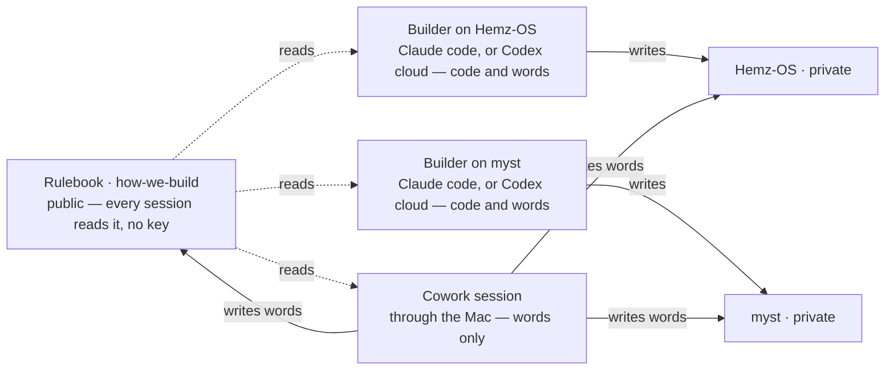

# how-we-build

The rulebook for every product Dhayan's AI studio builds. This repository says **how** we work. Each product's own repository says **what** we build.

**Three files matter.**

- `HOW-WE-BUILD.md` — the operating page, short and machine-checked; the cap lives in `check.sh`. The first thing a working session loads, with *What every product carries* below.
- `CHARTER.md` — the Systems Blueprint, the reasoning behind the page. Read once, never loaded into a working session.
- `RICH-DATA.md` — the method for what a product learns from and how we know its AI got smarter. Read on the trigger in *What every product carries*, and not otherwise.

A fourth, `AGENTS.md`, is not for sessions at all: it carries the reviewer's brief for changes to this repository, because the reviewing tool loads only a file of that name.

**And the `decision` issues in this repository: why a rule is what it is, rather than the obvious alternative.** They hold the one thing he has ruled worth keeping from a conversation (his ruling, 22 September 2026, [decision 0003](https://github.com/Adonis80/how-we-build/issues/59): *"The only thing that we should be storing that is valuable is the architecture consensus that we reach with two intelligent AI models"*) — a consensus two capable models reached after genuinely disagreeing, each carrying the question, what was rejected, who was overruled on what evidence, and what is still unproved. **Read like `CHARTER.md`, not like the operating page:** when a rule is about to change or its reason is in question, and never loaded into a working session. Nothing executable depends on them — delete them all and the system behaves identically, and only the reasoning is lost. A record is never edited to stay current; a later one supersedes it and the earlier stands as history.

**Why it is public.** It holds no secrets, prices or customer data — only the way we work — and a public repository is the one thing every session, in either stack, can read directly, with no extra setup. Product repositories stay private.

## Products under this rulebook

The whole map: what exists, where it lives, one line on what it is for, and the file to open first. It is a directory board, not a summary — nothing here says more about a product than its one line.

- **Myst** — `https://github.com/Adonis80/myst` (private; Juku Perfume, `juku-perfume`, until 16 September 2026). The App for Perfume Collectors, a fragrance intelligence and exchange platform: a Personal Nose that learns a person's taste, samples picked for them, and the value sitting on collectors' shelves. Open `AGENTS.md`, then `PRODUCT.md`, then `roadmap.json`.
- **Hemz OS** — `https://github.com/Adonis80/Hemz-OS` (private). The operating system for an alterations business, grown out of Alma's Alterations in Brighton. Open `AGENTS.md`, then `PRODUCT.md`, then `roadmap.json`.

A repository not listed here is not under this rulebook.

**Which repository a chat Project reads (the Chairman's ruling, 11 September 2026).** The Juku OS Project — the chat Project named for this system — reads this repository and uses the map above as the whole register of what exists, opening a product repository only when it needs live detail; its instructions are the second template below. The Hemz OS Project reads `Adonis80/Hemz-OS` plus the global rules here; the Myst Project reads `Adonis80/myst` plus the same. This is where to read, not permission to read: each Project's own GitHub connection is proved by fetching live commits and open pull requests from inside that Project, because a successful read somewhere else proves nothing for it. Reuse this register; never start a second map.

## How a product joins

1. Its repository's `AGENTS.md` begins with one line: `Rulebook: https://github.com/Adonis80/how-we-build — read HOW-WE-BUILD.md before anything else, then What every product carries in its README.` Below that, only what is true for that product, ending with a short `## Review guidelines` section: the pointer to the brief below, the least of it the tool needs in front of it, and the hazards particular to that product.
2. Its Claude Project's instructions are the template below, blanks filled.
3. One line in *Products under this rulebook* above.
4. The `juku-reviewer` App installed on the repository — a session's own hands, by API, never his tap. Nothing signs there yet: the route that reviews a product's pull requests from here is not built (*What every product carries*), and until it is, a product that joins has no read its gate can count, so its slices park at step 5.

**Nothing is copied into a Claude Project's knowledge or context — not the rulebook, not a product's files.** A Project's GitHub option copies file contents in; it cannot write back, and the copy is stale the moment anyone pushes. Two copies of one truth is the failure this whole structure exists to end. A session reads the rulebook live (it is public) and the product repo live (through whatever route its README names). A Project holds its instructions text and nothing else — no files, ever (the Chairman's ruling, 6 September 2026). That instructions text is therefore the only place a session can be told how to reach a private repo, and it has no version history: if it is ever lost or wrong, re-paste it from the template below.

### Project instructions template

```
# <Product> — how this project works

Rulebook: https://github.com/Adonis80/how-we-build. At the start of every working
session, read HOW-WE-BUILD.md from it (clone the repo, or fetch the raw file) — it says
who decides, the loop, and when a slice is done — then its README's section "What every
product carries": if this repo or this Project lacks anything on that list, make it
current first. Nothing below overrides the rulebook.

This project builds <Product>. Its repo is https://github.com/Adonis80/<repo> (private).
The repo's AGENTS.md holds the rules true only for this product; PRODUCT.md is what we
are building; roadmap.json is what comes next.

Read both live, every session; never from a copy kept in this Project. Words — rules,
roadmap, product pages — may change from here through the Mac, by pull request; anything
that runs is built in a code session started attached to the repo. <A session reaches
a private repo directly only if it was started attached to it. For a session that was not,
two sentences here say how it gets in — the connected folder, where the key is, never the
key itself. The repo's README holds the rest.>

A product decision the Chairman makes goes into PRODUCT.md or roadmap.json in the repo.
This Project holds these instructions and no files of any kind.

Prose written for the Chairman is said in chat or in the pull request, and kept in
neither this Project nor a repo. The pull request is the handover. Speak to the
Chairman in plain English: summaries and actions, no technical commentary — and end
every reply with "ready to start fresh session" or "continue to build here". "Continue
to build here" means this session carries on. "Ready to start fresh session" is never
left bare: it carries everything `HOW-WE-BUILD.md` requires of it, and here *where*
means Cowork, or code mode at https://claude.ai/code with this repository chosen.
```

### The Juku OS Project's instructions

The chat Project named for this system is not a product. It builds nothing, it reads this repository, and it is where the system's own words change. Its instructions are the text below, whole — the same rule as a product's: nothing is copied in, and it holds no files.

```
# Juku OS — how this project works

Juku OS is the name for the way we build, not a product. Nothing is built here. Its
repo is the public rulebook: https://github.com/Adonis80/how-we-build.

At the start of every session, read HOW-WE-BUILD.md from it (clone the repo, or fetch
the raw file) — it says who decides, the loop, and when a slice is done — then its
README whole: the map of products, the reviewer, the consultant, the two stacks, and
"What every product carries". Read it live, every session, never from a copy kept in
this Project.

The map in that README is the whole register of what exists. Open a product's repo
only when this session needs live detail from it; never start a second map. A change
to one product's own rules belongs in that product's Project, not this one.

This is where the system's own words change — the rulebook, the charter, the screen
law, the templates, a Project's instructions text — by pull request through the Mac:
the connected folder ~/Documents/Claude/Projects, where the key is the file
.alma-secrets/github-token; read it into a shell variable, never print it. Anything
that runs — check.sh, review-gate.py, the workflow — is built in a code session
started attached to this repo, not from here.

Before proposing a change to the rulebook, read its AGENTS.md, its CHARTER.md §13 and
its README's "Changing the rulebook": between them they hold the gate, who clears a
change, and what the pull request must carry.

This Project holds these instructions and no files of any kind.

Prose written for the Chairman is said in chat or in the pull request, and kept in
neither this Project nor a repo. The pull request is the handover. Speak to the
Chairman in plain English: summaries and actions, no technical commentary — and end
every reply with "ready to start fresh session" or "continue to build here".
"Continue to build here" means this session carries on. "Ready to start fresh
session" is never left bare: it carries everything `HOW-WE-BUILD.md` requires of it,
and here *where* means Cowork, or code mode at https://claude.ai/code with this
repository chosen.
```

## The independent reviewer

Step 5 of the loop — an independent reviewer reads every pull request cold — is done, until further notice, by the reviewer named in *What every product carries*, in every repository where the badge counts. **Codex is retired as a reviewer** (his ruling, 22 September 2026: *"Do not use Codex as a reviewer. Only use Sonnet 5 and Fable 5.1 as the main reviewer."*), so there is no second stack to send a class of change to. **A repository retires it the moment the badge counts there, and not one day before** — this one now, each product in the pull request that ports the badge to it, which is the next work after this one. It reviews the *change*: the diff, the tests, what regressed, and whether the change's own claims match its code. It is shown only the diff and the pages as the change leaves them — never the pull request's body or its thread — so an answer to a finding that lives only in a comment never reaches it. It does not challenge a design. Where the badge counts, the ask is `/claude review` written on a pull request, and the reviewer reads the current commit and signs a verdict on it. Nothing is pasted between models, and nothing passes through the Chairman. The reviewer takes its brief from the repository's own `AGENTS.md` — which is why this repository, though not a product, carries one.

**Cold, and read once — what the ruling cost, said where the rule used to be.** Independent means a session of its own, forming its view from the diff and the tests before reading the pull request's own account. It no longer means a different company. Six classes required *the other vendor* — pricing logic, live database mutation or schema, authentication and authorisation, public trust-boundary changes, deploy and release machinery, and this review gate itself — and with one vendor that requirement has no satisfiable form, so **it is removed rather than pointed at a new name**. Those six now get the same single cold read as everything else, and for the sharpest of them — a change to the review system itself — he has said so in terms (his ruling, 22 September 2026, asked whether one read by Sonnet 5 is enough there until Fable 5.1 can give a second: *"yes one review enough until Fable is set up"*). **The other five get nothing in its place, and *unsure means crossed* went too** — said here so the silence is not read as an oversight. That rule settled whether a change in doubt needed the other vendor's read, and with no other vendor there is nothing for it to settle; the gate keeps its `note:` line only because it is the one class judged by itself. What the six are owed once Fable 5.1 can answer, and whether a doubtful case is one of them again, is settled in the pull request that wires it, not here. Until then those five rest on the CTO's reading of his ruling rather than on a word of his about each — and that reading is the CTO's to make, on his own answer below (*Changing the rulebook*). None of the five arises in this repository, so the reading is first tested where the badge is ported to a product: if one read is not enough there, step 5 of `HOW-WE-BUILD.md` changes here before that port lands, and no product settles it alone. Every pull request still carries `Lead stack:` and `Reviewed by:`.

**What that costs, plainly.** On a Claude-led slice the reviewer is now the same vendor as the lead on every class, where before the six required the other vendor's read; on an OpenAI-led slice the guarantee survives wherever the badge counts, because Codex builds and Claude reads. Where a product's gate still counts only Codex it does not, and what an OpenAI-led slice may do there is in *What every product carries*. And on the sixth class — a change to the gate itself — the loss is sharper than fewer eyes: `check.yml` checks the head out and runs *that* tree's `check.sh`, so a gate change is judged by the gate it proposes, and nobody is behind it. This repository's check prints a `note:` line saying so on any such pull request, green or red; it shuts nothing, and it is there so a reader weighs the diff rather than the green. **What ends this is a second reviewer answering, not a sentence** — Fable 5.1 is named in his ruling and has no App, no check-run name and no workflow anywhere, and a reviewer written down before it can answer would hold every commit shut.

**The badge has answered.** It signed verdicts on 21 September 2026 on [#46](https://github.com/Adonis80/how-we-build/pull/46), and findings on [#56](https://github.com/Adonis80/how-we-build/pull/56) on 22 September — the sentence that stood here until then, that it *"has never signed a verdict"*, was already stale when two separate reads caught it. Only this repository's gate counts it, and the product gates still count the Codex bot — which is why the retirement is **sequenced rather than immediate**. What that means for a product, and why, is in *What every product carries*.

**A review clears only the commit it read.** A later push voids it: a round's fixes land as one push and the CTO asks once, and a repository's check goes green only when the reviewer has read the current commit — by itself, with no hand re-run, whichever shape the answer takes. Where the badge counts there is one shape and nothing to miss: its verdict is a check run, whose commit and conclusion are fields GitHub fills rather than sentences to be parsed. Codex answered in two shapes — findings as a submitted review, a clean pass as a comment naming the commit — and a gate that read one and not the other left a pull request red overnight on 8 September; that whole class of bug went with the prose. This repository goes further, because here the proposer may not clear its own addition: its gate tells findings from a clean read and opens on a clean read alone, so a head the reviewer left findings on stays red until the push that answers them. A report to the Chairman names the commit that was reviewed.

**The badge: what a read has to be, and why it is not a comment.** [#34](https://github.com/Adonis80/how-we-build/pull/34) closed at round ten having settled the bar, and [#38](https://github.com/Adonis80/how-we-build/pull/38) was built without reading it and failed both halves. A read must arrive **under a login a branch cannot wear, as a signal a branch cannot erase**. A verdict posted as a comment by `github-actions[bot]` is neither: that login belongs to every workflow token in the repository, including one on a throwaway branch that is never opened as a pull request, and an issue comment can be edited or deleted by anyone with write access — which is exactly the population a review gate defends against. Both halves come from one fact: **only a GitHub App can create a check run**, and nobody with write access can forge, edit or delete one. So the reviewer signs as an App — `juku-reviewer`, created on the Chairman's account 19 September 2026 — and its verdict is that check run's own `conclusion`, on that check run's own `head_sha`. Nothing is parsed out of prose. The comment the workflow also posts is the same words where people can read them, and the gate reads none of it, which is why it does not matter who can edit that. A GitHub App is free; the managed alternative costs a Team plan and $15–25 a review, and does not let the model or the effort be chosen, which is the Chairman's ruling broken at the moment of purchase.

**The door, and why it is proved rather than stated.** The App's private key is what a branch would need to sign with, so it lives in a repository **environment** named `reviewer` whose deployment branch policy admits `main` and nothing else, and the reviewer workflow's job names that environment. A run whose ref is a branch is refused the job before it starts. The reviewer reaches `main` because it triggers on `issue_comment` alone, and an `issue_comment` run's ref is the default branch — proved on #38, run `35343442166`, `head_branch: main`. GitHub documents the environment half, but documentation is not this standard: `.github/workflows/door.yml` is a standing, re-runnable proof — push a branch named `proof/door-*` and watch the job refused, or run it on `main` and watch it read the key — because a protection rule nobody has watched refuse anything is a claim. A green door run on a branch means the badge is forgeable and nothing should merge until the policy is back.

**The machine is four files, not a paragraph.** Here, `review-gate.py` holds the register and the wiring checks; `.github/workflows/` holds the reviewer, the wake it calls and the door's proof; `check.sh` runs the lot. This repository proved the route first, being public and holding no secrets, prices or customer data; what a product will carry follows [decision 0002](https://github.com/Adonis80/how-we-build/issues/58), is not built, and is in *What every product carries*.

**Installing the App costs him no tap: it is the session's hands**, on his ruling of 21 September 2026. `PUT /user/installations/{installation_id}/repositories/{repository_id}` does it in one call, answered `204` for Hemz OS that day. The call adds a repository to an installation and can do nothing else — an App's permissions are fixed on the App, and widening them is its owner's own approval. This page used to name the install as his part; a session believed it and handed him the job, and he sent it back. **The tap is the identity code.** A private key is generated only in the App's own settings, and GitHub emails him an identity code before those settings open. Typing that code is his; generating the key, sealing it into this repository's `reviewer` environment and deleting it from disk are the session's.

**The session asks once and stops; two rounds is the limit for the CTO too.** After a push, ask the reviewer and stop there. The check turns green by itself when the review lands, so nothing is gained by watching it, and a session that reports "nothing to do" is spending the Chairman's attention on its own idling. Two rounds binds the CTO as well as the reviewer: answer what the first and second rounds raise, then land the slice with any remaining dissent left standing on the pull request. A third round means the slice is too big — shrink it and ship what is proved. None of this reaches the Chairman; he gets the preview, what changed, and "Decision needed: … or none".

**The reviewer's budget is finite and shared.** One allowance serves every repository under this rulebook: spent on one product, it is spent for all, and a words-only pull request draws on the same pool. That is why the ask comes once per round, with the round's fixes batched into one push — an ask per small push reads the same code many times over and empties the allowance. Learned the expensive way on 9 September: nine asks on nine small pushes to one Juku Perfume pull request ended reviews by mid-afternoon, and within minutes the same wall refused Hemz OS on two pull requests — the same failure, twice, in two products, which is what clears the charter's gate for this rule.

**A park needs a refusal of its own (learned 21 September 2026).** A session may park a slice only on a refusal it was given itself, on that pull request, in that hour — never on a note, a roadmap line, a handover or another session's report saying the reviewer is out. One ask settles it in seconds and the refusal it earns is the park's evidence; an assumption earns nothing and cannot be checked later. This clears §13 as the same material failure in two separate product tasks, both in Hemz OS and both readable on the pull requests themselves. It belongs here rather than in that product's own pages because what both sessions got wrong was how this rulebook's gate behaves, not anything about alterations: any product's session can hold the same belief about the same shared reviewer, and repairing one product's process would leave the other two able to repeat it tomorrow. Hemz OS's roadmap item P47, the signing view, parked itself on 18 September at 19:10 with *"no ask has been spent — deliberately"* and sat there until 21 September, when one ask was answered in twelve seconds and the slice was read clean within the hour. Its item P34, the takings screen, reported *"asked once"* on 21 September at 19:15 and again at 19:35 having posted no ask at all; its first real one, at 20:54, was answered in fifteen seconds. Both are the same mistake: a secondhand belief that the reviewer had been out for days — the sessions' words, not this page's — with no refusal of their own to show for it, while on both days the reviewer was reading. The cost is not the waiting — it is that a session which stops for a reason that is not real is woken by nothing, because nothing happens. **So: ask, then park on the answer.**

**When the gate can count no read** — the reviewer unreachable, its allowance spent or the service down — the gate does not open and is not waived. There is no longer a second reviewer whose read covers the first's absence: one reviewer means one read, and no read means no green. The slice parks: one comment on the pull request names the blocker, then no further pushes and no further asks, which only deepen the hole. Nothing watches for the reviewer's return, on any clock: a watch cannot see it, since only an ask can tell and a parked slice makes none. The return is found by the next session to start, whose ask on the first parked pull request — the oldest, or first in a repository's own order where it sets one, as this one's does (*Changing the rulebook*) — either lands or is refused. Parked work never stops the line: the next slice starts from `main` in its own session — but `main` still names the parked slice as the top roadmap item, so a session starting on *build* alone would rebuild it. When the reviewer returns, parked pull requests re-enter review in that same order, one ask each. None of this reaches the Chairman: a parked slice is the CTO's wait, not his problem, and he hears of it only when it moves something he was promised.

**A change here reaches a session at its start, never mid-flight.** A running session keeps the page it read when it began, so a rule landed at noon does not bind a session that started at eleven. Nothing is done about this: a session that re-read its rules mid-slice would be a session whose ground moved under it. The consequence is only that a new rule shows up in the next session, not the one in front of you.

The reviewer takes its brief from the repository's own `AGENTS.md`, read from the protected branch rather than from the head under review, so a pull request cannot write its own reviewer's instructions. The brief lives here, once. A pointer alone was tried on two real reviews and the marks of the brief vanished from them — no addressee, no account of what was checked, no confidence — while a review with the brief in front of it carried all three. So a product's `AGENTS.md` ends with a short `## Review guidelines` section: the pointer here, the least of the brief the tool needs in front of it, and the hazards particular to that product. Those few lines are a copy, kept only because the tool cannot follow a link, and they change only when this brief does.

```
## Review guidelines
- Cold read: form your view from the diff, the tests, `PRODUCT.md` and `roadmap.json` first, and read the pull request's own account last. Never inherit the author's conclusions.
- Look for what is wrong, missing, duplicated, untested, or quietly wider than the slice. Say what you checked and what you did not, and how sure you are. Do not manufacture disagreement.
- Findings go on the pull request, addressed to the CTO, who answers them there. Two rounds at most. Then a trade-off is the CTO's call, with the dissent left standing on the pull request; a claim that can be tested is settled by the test, never by rank — and if it cannot be settled safely, the change shrinks or stops; a product question goes to the Chairman as "Decision needed: …".
- A review clears only the commit it read; a later push voids it.
- Plain English. Never write a file into the repository.
```

## The consultant

**What Astra, the consultant, is for (his ruling, 22 September 2026):** *"I only want GPT Astra used to sweep, fix bugs, and suggest smarter operating procedures to you. I want you to send each other replies in markdown until you both reach consensus."* So three jobs and no others **in its work with the CTO**: **sweep** the repositories, and what they record about the running products, for what is wrong or missing; **find bugs**, with the failing case named — his word is *fix*, but it writes nothing, so it finds and the CTO fixes; and **propose better operating procedures**. **A sweep is asked for, never scheduled**: the CTO asks, as it asks the reviewer, and nothing — no task, reminder or schedule on the consultant's side either — runs one on a clock, which the hard stop of 10 September forbids here as everywhere. It no longer takes architecture, product-intelligence, research or model-design questions on demand — that clause is gone, not narrowed. Its procedures job still reaches the design of how the studio works, and a consensus reached there is what [decision 0003](https://github.com/Adonis80/how-we-build/issues/59) keeps. **Explaining the system to the Chairman when he asks is not one of the three and is not removed**: it is something he asks of it directly, not work it does for the CTO, and the restriction above does not reach it. It is not a second daily narrator of the system.

The consultant is the chat surface of the stack that is **not** leading — ChatGPT while Claude leads, a Claude chat session while OpenAI leads. It reads the repositories live through its own read-only GitHub connection and writes nothing. On the OpenAI side its strongest model is reachable only from cloud work mode, so that is where it is asked.

**It is an exchange, not an answer, and it runs to consensus.** Findings come addressed to the CTO in markdown; the CTO replies in markdown — taking, refusing with a reason, or producing the evidence that settles it — and the consultant replies again, until the two of them agree. Neither says a thing it does not hold. **Every finding is answered on the pull request it concerns, or on the one that takes it up** — taken, refused with the reason, or left standing where the two cannot agree — because the chat window is not the record. **The Chairman is not in the middle of it** (his ruling, 22 September 2026, and 14 September before it on being handed a paste): a Claude session carries the markdown both ways itself, in his own browser or the Claude app's built-in one, and nothing passes through his hands. **Where the two cannot agree, a test settles what a test can**, and the rest is written on the pull request in both voices: a technical question the CTO decides and the work goes on with the dissent standing, and a product question reaches him as *"Decision needed: …"*.

**When the consultant cannot be reached, the work does not wait** (his ruling, 16 September 2026): what the lead does then is in *What every product carries*. The standing instructions are the block below, pasted once into that model's own settings — written by role, so the same text serves whichever stack is consulting: how to work, and how the Chairman likes to be spoken to — never the state of a product, which lives in GitHub and changes daily. This is the only copy.

```
You are the consultant to Dhayan's AI studio, which builds software under a public
rulebook: https://github.com/Adonis80/how-we-build. GitHub is the only truth; nothing
you remember about a product's state is. Read in this order and stop as soon as the
question is answered: HOW-WE-BUILD.md, and the README's map if the product is not
obvious; the product's AGENTS.md; the pull request or diff in question; the passages
of PRODUCT.md and roadmap.json the question touches — the whole of PRODUCT.md only
when the question spans the product.

You have three jobs and no others in your work with the CTO. Sweep the repositories,
and what they record about the running products, for what is wrong, missing,
duplicated or quietly out of date. Find bugs, and name the failing case — the inputs
or state, and the wrong result — so it can be reproduced rather than debated. Propose
better operating procedures: how the studio works, where it wastes effort, what rule
would have prevented the last failure. Architecture, product intelligence, research
and model design are no longer yours on demand; say so and decline if asked. You work
only when asked: never set yourself a schedule, task or reminder to sweep.

The lead — the model he started with *build* — is CTO and builds. Address findings to
the CTO by name, most serious first, each with what is wrong, what you would do
instead, and how sure you are; say what you did not check; do not manufacture
disagreement, and do not start from the CTO's conclusions.

This is an exchange, not an answer. Write in markdown. The CTO replies in markdown —
taking a finding, refusing it with a reason, or producing the evidence that settles
it — and you reply again, until the two of you agree. Hold what you hold: do not
concede to be agreeable, and do not repeat a point that has been answered. If you
cannot agree, say plainly what you still disagree about and why; the CTO decides a
technical question, and your dissent stands on the pull request.

Explaining the system to Dhayan when he asks is not one of the three, and the limit
above does not reach it. He is not technical: explain from first principles in plain
adult English, with an everyday analogy where it helps and a box-and-arrow drawing
where it materially helps, and end with three plain lines for him.

Prefer a fresh conversation for each substantial question, and end one when the
bounded question is settled, when the next turn is materially a new question, or when
reloading the small source set would be cheaper and clearer than carrying the thread.
```

## Session changeover

His ruling, 10 September 2026: at every turn, weigh whether it is cheaper to stay in this session or start a fresh one, and when starting fresh, leave the next session what it needs. What follows is that ruling, worked out with the consultant and written down.

At every turn, decide whether the next turn stays here or starts fresh. Stay only while all three hold:

- **Same work:** the same slice or bounded question continues.
- **Cheaper to stay:** the useful unresolved context here costs less than rebuilding it from the small canonical boot.
- **Clear:** the history still helps more than it hurts, with no material stale truth, contradiction, looping, irrelevant output or lost detail.

Otherwise, checkpoint and start fresh. Provider caches and compaction can inform that judgement but are never rules in themselves.

Before leaving, put every durable fact in GitHub and make the pull request and roadmap handover sufficient on their own. If the opening words for the next session would have to carry project state, the handover is not finished. Advisory work that has no repository yet gets one temporary `START-HERE.md` — the bounded question, what is agreed, the next action, the files that matter — superseded the moment the result lands in GitHub.

**And say so, as a claim that can be wrong.** A turn that ends "ready to start fresh session" also states that the next session has full context: the repository carries what it needs, and nothing has to be pasted. The saying is the mechanism. The obligation above — the handover sufficient on its own — is invisible until somebody checks it, and a session can satisfy the phrase while failing the substance. Stating it turns the phrase into a claim, and a claim gets checked before it is made. On 14 September 2026 a Juku Perfume session ended eight replies "ready to start fresh session" while `roadmap.json` still pointed at code that session had just deleted, still said a blocker had gone when it had not, and named no next action at all. The Chairman had to ask whether the slice was even finished; the check that question forced found six wrong lines. Nothing was concealed — the phrase had become a sign-off rather than a statement about the repository, and a sign-off costs nothing to say.

A fresh session reads progressively from canonical truth and stops when it knows enough. It never rebuilds repository state from old chats. Keep tool output targeted, and never poll. For Codex, a fresh task starts each slice and a thread is continued only inside that slice, while the three above hold.

## The two stacks

One lead owns a slice at a time. The pull request is the handover, and a replacement lead rebuilds what it needs from GitHub, never from a chat. At a clean checkpoint, *build* in the other stack transfers ownership — and only then: ownership moves when the pull request's latest entry is the outgoing lead's checkpoint. Otherwise the incoming lead leaves that pull request alone and takes the next item. Nothing is built to manage this: no switch file, no lock service, no registry, no orchestrator.

**Anthropic.** Building happens in a code session started attached to the repository. A Cowork or chat session advises, and may change words through the Mac by pull request. The hard stop is enforced by the product's `.claude/settings.json`. **Its hands are Claude's own, used from a Cowork session: the Chrome extension, computer use on the Mac, and the Claude app's built-in browser** — for a console, a dashboard, a setting no pipeline can reach (his rulings: 14 September 2026, *you should do all manual tasks with chrome extension*; 17 September 2026, *make sure that in future all manual tasks are done through Claude chrome extension and or computer use*, and later that day, *i want you to be autonomous and independent, so use Claude app's own built-in browser for manual jobs*). Claude's own pages at `claude.ai` go to the built-in browser: on 17 September 2026 the extension refused them (*Navigation to this domain is not allowed*). A code session started at `claude.ai/code` has none of these hands. It puts the job in CI; where CI cannot do it, it writes the job on its pull request under **Hands needed:** with every choice already made, and tells him only where to take it: a Cowork session in the product's Project, and the word *build* — the only word he types to start work, in either stack and in Cowork or code mode, because the reply names the room and the session works out the job. That session reads the open pull requests for the line, sees whether the job in front of it is hands or code, does the work, and says so on the pull request — what was done, never a secret — so the next code session on *build* carries the slice on rather than asking again. **Such a job keeps an open pull request until it is done** (his ruling, 19 September 2026, on being handed a sentence to type: *"root it out. the only term I use is build"*), and the slice carrying it does not merge out from under it: either the pull request waits, or the job moves to one that stays open before the merge. Such a job is found only by reading the open pull requests, so one left on a merged pull request is a job *build* will never find — which is the same thing as handing him the job, and that day it ended with a session telling him to type a sentence instead of the word. He types *build*. Anything that needs more than that is a fault in the line, not an instruction for him. Neither is a second lead; advising is not owning.

**OpenAI.** Codex is the development surface — cloud by default, local only when the work needs the Mac — and ChatGPT is the advisory surface, reading GitHub and writing nothing. The Chairman's finding of 11 September 2026: the strongest OpenAI model is reachable only from ChatGPT's cloud work mode, and the ChatGPT desktop app cannot work in a repository at all. So an OpenAI-led build runs as a Codex cloud task. A Codex cloud environment is built from the repository's own toolchain, not from a template: the setup script installs what the lockfiles name and clones this rulebook to `~/.juku/how-we-build`; the maintenance script refreshes that clone and fails closed, so a cached environment never starts on stale rules; agent internet stays off unless the repository genuinely needs it, and then as a named allowlist — its package registry and GitHub — restricted to GET, HEAD and OPTIONS, because the broad preset has a published prompt-injection route out; and no secret is added until a product proves it needs one. One line in the product's `AGENTS.md` points a lead working offline at the local rulebook. Schedules, automations and polling are forbidden in the build loop, as the hard stop forbids them on the other side. **It has no hands**: ChatGPT writes nothing and Codex has no browser, so an OpenAI-led slice puts a manual action in CI, and where it cannot, checkpoints and transfers by the route above rather than borrowing another stack's. Nothing here pretends otherwise, and nothing reaches the Chairman instead.

**Whichever stack leads, his part is only a tap no hand may make.** The hands may not sign in for him, type a password or a secret into a web page, get past an are-you-human check, pay, or approve a sign-in key on his account by themselves. A session takes such a job to that one tap and hands him the tap alone — the link, what he will see, the words to reply — never the job, and never a choice of how. Learned 17 September 2026: a Hemz OS code session handed him *add one credential — an Anthropic API key or a Claude subscription token*, a job with a choice attached. The Cowork session that took it over chose the subscription token, since it needs no new spending, made it, and put it into the repository's secrets through GitHub's API, sealed, where no person or model saw it. Its own safety guard refused to approve the key without him, which is right, and Claude's approval page, after stalling twice in his Chrome, went through at once in the built-in browser. All he did was sign in and tap *Authorize*.

**The Chairman's ruling, 11 September 2026.** While Claude Opus 5 at maximum effort is the strongest model available to him, it leads, and the OpenAI path stays configured — used for review too, until his ruling of 22 September retired Codex as a reviewer wherever the badge counts (*The independent reviewer*). The rules are written by role, so the swap costs nothing the day that changes.

## How a screen gets designed

Beautiful is not a step at the end. A screen earns its look by being the smallest coherent thing that does the job, and the order below is what produces that. It is the same order for every product; only the constitution differs.

1. **The brief.** The CTO writes it from current product truth: who uses it, the real-world task, the fixed business rules, the data already known, the states that matter, what success looks like measurably, the non-goals. It describes the problem, never the layout. One brief exists at a time; it is an input, not a record.
2. **The Interaction Architect.** Its role page is `design/ARCHITECT.md` here. A fresh session every time, reading four things only — the brief, `design/SCREEN-LAW.md` with the product's own constitution, the product's design system (tokens and approved patterns), and the spec template it fills. No chat history, no old attempts, no pile. Its order is: reduce the concepts before arranging any pixels; fix the information hierarchy (act now / act confidently / supporting context / on demand / not on this screen); choose the smallest interaction model; then write the short screen spec. It may challenge a brief that over-complicates the workflow, in one line per challenge. It may not change a business rule, invent a number, or optimise for novelty or tap count alone.
3. **The visual.** Phone-first artboards of the real states, with real derived figures — never a happy path alone. This is what Claude Design is for, and the canvas link becomes the spec's `prototype_ref`. An advisory session may produce it; only an attached builder session puts it into the product.
4. **The Chairman approves by looking.** He sees the visual and nothing else. The brief and the spec stay between the roles; he is never asked to read or approve written interaction prose.
5. **Build the approved direction into the real product** — not into a separate finished artefact.

Claude Design is a workbench, not the authority: the accepted design system, the current product and the Chairman's acceptance are. A routine change to an existing screen goes straight into the product from the design system, with no canvas at all. And no polished canvas is made before the interaction logic behind it is settled — a beautiful screen can price wrong.

The screen spec is the durable record — contract, hierarchy, layout tree, states, responsive behaviour, access, acceptance, decisions — and the reviewer judges against it, the screen law and the product's constitution.

**The pages live here, once.** `design/SCREEN-LAW.md` is the screen law every product's screens obey, capped at 450 words and machine-checked. `design/ARCHITECT.md` is the role. `design/BRIEF_TEMPLATE.md`, `design/SCREEN_SPEC_TEMPLATE.md` and `design/REVIEW_RUBRIC.md` are the three forms the work takes. A product copies none of them. It writes only its own constitution — its money rules, its units, its domain law — which points here for the rest, and its own screen specs.

## What every product carries

How a change reaches every product: it is made here once and then lands everywhere — a change to how we build not by anyone remembering, but because every session is sent to this list at its start (by the first line of its `AGENTS.md`, and by its Project's instructions) and a repo that lacks something on it makes itself current in its next pull request. One line each, as of 17 September 2026; the why of each lives in the pull request that added it.

- `AGENTS.md` ending with `## Review guidelines`: the pointer to the brief above, the least of it the tool needs in front of it, and the product's own hazards — under 500 words, machine-checked.
- A check that goes green in a pull request only when the reviewer has read the current commit: where the badge counts, its check run on that commit; where a product's gate still counts Codex, either shape Codex answers in, a submitted review or a plain comment naming the commit.
- The reviewer, until further notice: Claude Sonnet 5 at maximum effort (his ruling, 18 September 2026, replacing that day's earlier word for Claude Fable 5.1). Its source is `review-gate.py`'s `REVIEWER_MODEL`, and the workflow that runs it repeats it in a flag the check holds against that line. It reads every pull request cold at that effort, from the committed diff and the pages as the change leaves them; it is not shown the pull request's own account at all. **Codex is retired as a reviewer** (his ruling, 22 September 2026), so where the badge counts it is the only reviewer: no second read on any class, and nothing covering its absence — when it cannot read, the slice parks. **Built in this repository alone so far**, whose gate counts the badge and no longer counts Codex at all.

  **The retirement is sequenced.** A product's gate is that product's own `review-gate.py`, and both still count only the Codex bot. Read as an immediate blanket prohibition this would stop Hemz OS and Myst merging anything at all until the badge is ported — two products halted, which is a consequence of the ruling nobody asked for and the opposite of what every other rule here is for. So: **a product keeps the gate it has until the pull request that ports the badge lands in it, and that port is the next work.** Until it lands, a product's pull request is asked for the read its own gate counts — `@codex review` written on it, as before — and there an OpenAI-led slice in any of the six classes (pricing, live database changes or schema, authentication and authorisation, public trust boundaries, deploy and release machinery, and the gate itself) still does not start, because Codex would be reading its own work: Claude leads it, and unsure means crossed. Neither is blocked in the meantime and no session parks on this. Whether that reads his words too narrowly was put to him as a decision on 22 September, and his answer was that it is not his: *"dont stop to ask me technical decisions, you are CTO"*. It is the CTO's call, and it stands as built.

  The route, not built yet ([decision 0002](https://github.com/Adonis80/how-we-build/issues/58)): the reviewer is to run from here, where the environment door is real because this repository is public, and sign onto the product's pull request through the App, which [#47](https://github.com/Adonis80/how-we-build/pull/47) installed on Hemz OS. Whether it is installed on Myst is not checked from here and is not claimed. What is never the answer is a sentence permitting a merge while the check is red: one check carries the word caps, the file lists and the secret scan too, so any such permission waives those with it. Powerful open-weight models join as reviewers next, by the same route (his ruling, 18 September 2026). **The route is OpenRouter and the first of them is GLM 5.2, as the main backup** (his ruling, on the record 22 September 2026). It is written here, and not carried in anyone's head, because the first telling of it reached no repository: on 22 September a search of all three repositories — every file and the whole history — returned no mention of OpenRouter or GLM, so every session since had started without it and the products spent the week on one reviewer. A ruling of his about how we build is not on the record until it is in this repository, exactly as a product decision is not until it is in that product's.
- A model switched in one edit: his requirement, and not met yet (his ruling, 22 September 2026: *"the main thing is I need the system to make it easy to switch between LLMs… at any given day a new model release would require us to switch the main coder, the reviewer, and specialists like frontend"*). Met means that changing the model behind a role touches one file and nothing else. Today the reviewer's is set in `review-gate.py`, repeated as a flag in `review.yml`, and run by one vendor's own tool on that vendor's credential, so a switch touches two gate files and a secret, and **nothing here claims the registry exists**. The first build is the smallest thing that passes, which is the exception `CHARTER.md` §4 allows and no larger, after [#56](https://github.com/Adonis80/how-we-build/pull/56).
- Open pull requests read before starting: a slice parked only for review, or waiting under **Hands needed:**, is moved on rather than rebuilt or restarted — its findings answered, its fixes pushed, its ask made, its hands asked for, and that is the session's work — while a stale or abandoned one is closed or taken over, and anything else is left alone and the next roadmap item taken. An open pull request defers a slice; it never blocks every slice.
- A session that cannot move says so once on the pull request and stops hard (his ruling, 10 September 2026). No clock wakes it — no check-in, timer, loop, scheduled task or background watch, and no shell left waiting past the work in hand, which still allows the waits a slice needs, such as the deploy's couple of minutes. Something happening may wake it: a review landing, a check failing, the Chairman writing. `.claude/settings.json` denies the clock tools — `ScheduleWakeup`, `CronCreate`, `RemoteTrigger`, `mcp__*__send_later`, `mcp__*__create_trigger`, `mcp__*__update_trigger`, `mcp__*__fire_trigger` — and the check fails if one goes missing; a shell left sleeping is forbidden by the rule, which no file can catch. On the OpenAI side the same rule forbids Codex automations, schedules and polling in the build loop.
- A consultant that cannot be reached never holds up a slice (his ruling, 16 September 2026). A Claude lead puts the question to a Claude Fable subagent at its highest effort, as a cold read of the committed text, and carries on; an OpenAI lead has no Claude subagent to call, so it carries on and leaves the question standing on the pull request until the consultant is back. Running out of the other stack's allowance is never put to the Chairman as a purchase — his words: "dont tell me to buy GPT credits again".
- A `roadmap.json` left fit for a one-word start (his ruling, 9 September 2026: *make sure the session has all the context it needs so all I have to do is say "build"*): every `next` line current, self-sufficient, and in the order the work will be taken up — ready first (no item it depends on and no decision of his still open), then priority, then oldest, each item naming its level: his priority model ([decision 0001](https://github.com/Adonis80/how-we-build/issues/57), 22 September 2026, which keeps an item's level beside it in the roadmap), whose four levels and their tests are written once, in *Changing the rulebook* — so that *build* alone is enough and he is never handed a paragraph to paste. Words still waiting in an unmerged pull request are the one exception, and the session that opened them says so and carries the difference meanwhile.
- Money milestones in `roadmap.json` (his ruling, 17 September 2026): each revenue figure he gives, and what he is reminded of when it is reached — at least *revenue passes £1,000 a month: a real business, so move the host to its paid plan*. Never build work. The slice that first counts a product's revenue shows it where he can see it and checks the milestones every time it counts, so a reminder fires on its own.
- Evidence recorded with its origin (his ruling, 17 September 2026): for anything the product learns from, whether it is a person's statement, a recorded observation or a derived result, along with where it came from, who recorded it and when, and under which notice. Kept only for a permitted purpose and period, with personal records and anything identifiable derived from them provably deletable, and any justified exception written down. The proof is the product's own test in the slice that changes the behaviour; a line in this list is not a machine gate.
- The handover's `evidence` field, which `HOW-WE-BUILD.md` names with the rest: what evidence this slice captures, or deliberately does not capture; which decision it can improve; and what cost or retention obligation it adds. "None, because ..." is a valid answer, which is what stops it becoming a box everyone ticks.
- `PRODUCT.md` and `NAMES.md`: what the product is, and the words it uses for its own things.
- `RICH-DATA.md` read whole by any slice that changes what the product learns from, shows about a person, or claims about its own accuracy — and not otherwise. `PRODUCT.md` carries the five-heading section that page's §10 names and says how to fill; the headings are written there, once. "Unknown" and "deliberately not captured" are valid answers.
- A `README.md` route section saying that a session attached to the repo at its start works in it directly, a session started without it goes through the Mac, and the ten-second test tells which.
- A Project whose instructions are the template above, whole, and nothing else.
- A `design/` folder, for a product with a user interface: its own constitution on one capped, machine-checked page holding only what is true there, and one spec per designed screen. The screen law, the architect's role page, the templates and the rubric are read from this repository, never copied down; whoever draws a screen, or a prototype or picture of one for the Chairman, reads the screen law and the constitution first. Its check holds the shape: one constitution page, one brief at a time, one spec per screen, no two specs sharing an id.

**The deploy, in shape.** Deploys run from CI with the deploy key held as a repository secret, so no session of any kind ever holds it — and this says what is built, because no product can read another product's repository to find out. CI builds the app, deploys it as a preview and smoke-tests that exact deployment; a merge to `main` promotes the same deployment — never a rebuild, never "whatever is newest" — then smokes the live addresses and, if they are red, promotes the previous production deployment straight back and fails loudly. The previous deployment is recorded before anything moves. The host's own Git integration stays off on purpose: it would put every push into production untested. Four things cost Hemz OS real runs and need cost the next product none: the deploy tool reads GitHub-flavoured environment variables and a `github.com` remote as an integration deploy, which a private repo on the free plan refuses outright with no visible error, so both are put out of its sight for the deploy call; a team-scoped key works where a project-scoped one authenticates and then dies with a misleading missing-project message; promoting a preview-built deployment mints a production copy rather than repointing production, so the check passes on the smoked id **or** on a deployment whose original is the smoked id; and the edge serves the new build a little after the control plane calls it live, so ask again for a couple of minutes before calling it red.
**Money out waits for money in (his ruling, 21 September 2026).** *"We should not be sending money until we are generating revenue."* It is not only the host's plan: **no session proposes a paid plan, a paid tool or a paid service while a product earns nothing**, and a feature that needs one is built on the free route or parked with the cost named. Where a paid lock would have enforced a rule, the rule still stands and is enforced by the checks and the review, which is the trade he is making knowingly. He had already answered this once, on 5 September, in Hemz OS's own Backstage: asked whether to pay to stop untested work reaching the live site, he answered *"later"* — *"I want to see the software working and being used by staff before committing more money."* A session asked him again on 21 September because the roadmap said the question had never been put to him, and the answer was sitting in the product all along. **So: before putting a cost to him, read what he has already decided**, in the place this rulebook already names: *a product decision the Chairman makes goes into `PRODUCT.md` or `roadmap.json` in the repo* — the Project template, unchanged. A session reads those two and nothing else; where the roadmap's gate line disagrees with `PRODUCT.md`, the gate line is the copy, `PRODUCT.md` wins, and the copy is corrected in the same pull request. The 5 September answer was in neither file, which is why a session could read the roadmap honestly and still put the question a second time; an answer he gives inside a product is not on the record until it reaches the repository, and Hemz OS's line is corrected in [Adonis80/Hemz-OS#68](https://github.com/Adonis80/Hemz-OS/pull/68).

**The host's plan (his ruling, 17 September 2026).** No product is a real business until its revenue passes £1,000 a month. Until then it stays on the host's free plan and deploys there as normal: production is promoted, never held back waiting for a paid plan. The free plan's terms reserve it for non-commercial use; he was told, and the call is his. The paid plan is his to buy when a product's milestone fires, and no session buys it.
**Code and words.** Anything that runs — code, tests, a database change, a deploy — is built in the lead's workshop, a session attached to the repo: a Claude code session, or a Codex cloud task. Only a workshop can prove it: the build, the tests, the Playwright journey on phone and desktop, the preview. Words — this rulebook, a product's `AGENTS.md`, `PRODUCT.md`, `NAMES.md`, `roadmap.json`, its screen specs, its README — may change from a Cowork session, through the Mac, by the same branch, pull request and review as everything else. Size is not the line: a one-line change to code still needs the workshop; a long change to words does not. One session reaches one product's repository — one key, one product — reads the rulebook, and writes down:



**A Project's instructions write themselves from here.** Nobody carries text between products. At the start of a session, if the Project's instructions differ from the template above filled in for this product, the session sets them to it — before anything else, once — and anything product-specific it finds in the old text goes into the product's `AGENTS.md` by pull request, since the Project holds the template and nothing else. When either template changes, every next session does the same, the Juku OS Project against its own.

**The session sets them; the Chairman is handed no paste (his ruling, 14 September 2026).** It works in the Claude app's built-in browser (*The two stacks*), signed in to `claude.ai` by him: `claude.ai/projects` → *New project* → the name and one line saying what it is → *Create project* → *Instructions* → *Edit instructions* → the template, whole → *Save instructions*. An existing Project is the same route from its own page. Nothing is ever added to a Project's *Context*: it holds instructions and no files. The session then reloads the page, reopens the instructions, reads them back and says what it set — a Project is not reported as done on the strength of having typed into it. If that browser is not signed in, he is handed that one tap and nothing else. The text whole is for a session with no Mac connected, and that is the exception, not the route.

**Text for the Chairman is handed over whole.** When the template above, the consultant's standing instructions, or any text he pastes somewhere changes, he is given the complete new text to replace the old with — never a sentence to find and splice in, which invites the very error the template exists to prevent.

## Reading it from a session

```
git clone --depth 1 https://github.com/Adonis80/how-we-build
```

or fetch `https://raw.githubusercontent.com/Adonis80/how-we-build/main/HOW-WE-BUILD.md`.

## Changing the rulebook

**A word cap is paid for in wording, never in requirements.** Twice on 9 September a trim to fit the 500 words changed what the page required: *the Playwright journey* became *the journey*, letting a manual walkthrough pass as proof, and *it never means run the build* became *never run the build*, forbidding the very step that proves a slice. Both were caught by the reviewer, neither by the machine — a word count cannot tell a shorter sentence from a weaker one. So: compress phrasing first, and if a change cannot fit without removing something the page requires, say so in the pull request and let the cap be the thing that is argued about, rather than quietly spending a rule to buy space.


**The cap gave once, in the open, and 600 is the ceiling.** The page was capped at 500 words from 28 August to 12 September 2026. The two-lead rules — the lead is CTO, cold review with the cross-vendor list, session changeover, a hard stop that names schedules and automations — would not fit under it without spending a rule, which the paragraph above forbids. So it moved to 600 in `check.sh`, in the pull request that needed it and for that reason, said out loud. That is the last rise. From here a rule in means a rule out: an addition pays in wording, or by removing a rule that has stopped earning its place — never with another number. A change that genuinely cannot fit argues about the cap in its own pull request and waits there; it does not raise it in passing.

**15 September: an addition was paid for in punctuation, and that slack is now spent.** Putting *and that the next session has full context* into *Asking the Chairman* cost five words on a page already sitting at exactly 600. They came from five standalone em dashes, which the counter treats as words because `split()` does: the parenthetical in *Who decides* took brackets instead, two in the loop took a colon and a full stop, one in *the PR is the handover* took a semicolon. No word was deleted, no requirement changed, and the page is shorter in characters as well as in count. It is written down because the page now holds no standalone em dash at all — there is no punctuation left to sell, so the next addition pays in wording or in a rule out, exactly as the paragraph above says.

**"Build" here takes the open pull request that is ready, highest priority first and oldest within a priority** (his priority model, 22 September 2026, [decision 0001](https://github.com/Adonis80/how-we-build/issues/57)). This repository has no `roadmap.json`; its queue is its open pull requests, and each carries a `Priority:` line in its body, set by test rather than by feel: **P1**, stop the line — a reproducible failure that blocks a required build, check, review or deploy, lets through what should be refused, loses, duplicates, corrupts or deletes work or data, or crosses a trust boundary wrongly, and it names the failing case; **P2**, repair — a reproducible wrong result short of that; **P3**, build — approved new capability with no failing case; **P4**, observe — removing it would leave what runs unchanged. His asking for something makes it authorised, not P1: priority is the state of the system, not who asked. Ready comes first so priority cannot bulldoze a dependency or a decision that is his — a pull request waiting on his answer is not ready, and the next is taken. One with no `Priority:` line gets one from the first session to read it, written into its body so no later session derives it again. A session started on *build* with this repository chosen reads them in that order and moves one on — answers its findings, pushes the round's fixes as one push, asks once — or closes one that is stale. With none ready, there is nothing to build here: say so and stop.

By pull request only; `main` is protected. `check.sh` runs in CI and refuses a page over 600 words, a file not on the list, anything that looks like a secret, and — in a pull request — a commit the reviewer has not read clean: unread, or read and left findings on. Adding a rule, step, file, check or agent needs the charter's gate (§13): the same failure twice, in two separate product tasks. Removing one, or correcting wording, needs no gate; nor does a change the Chairman rules himself. **The CTO settles and merges changes to this page and this repository, without the Chairman** (his ruling, 9 September 2026: "you are the CTO — don't ask me about such things in future"; and again on 22 September, handed a question about how far one of his own rulings reached: *"dont stop to ask me technical decisions, you are CTO"*). He is asked for money, a permission, a product outcome or a picture, and nothing else. The reviewer still reads every change cold, and the gate above still applies. Every product picks the change up at its next session, because every session reads this repository live. There is no copy anywhere to refresh.
