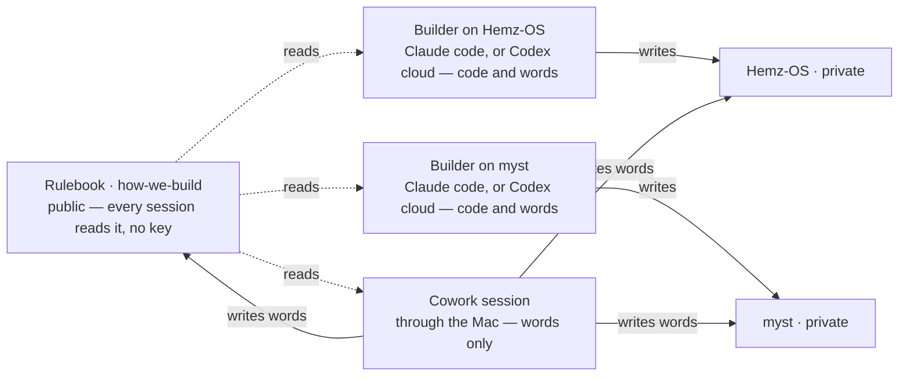

# how-we-build

The rulebook for every product Dhayan's AI studio builds. This repository says **how** we work. Each product's own repository says **what** we build.

**Three files matter.**

- `HOW-WE-BUILD.md` — the operating page, short and machine-checked; the cap lives in `check.sh`. The first thing a working session loads, with *What every product carries* below.
- `CHARTER.md` — the Systems Blueprint, the reasoning behind the page. Read once, never loaded into a working session.
- `RICH-DATA.md` — the method for what a product learns from and how we know its AI got smarter. Read on the trigger in *What every product carries*, and not otherwise.

A fourth, `AGENTS.md`, is not for sessions at all: it carries the reviewer's brief for changes to this repository, because the reviewing tool loads only a file of that name.

**And `library/`, indexed under *Where each topic lives* below.** It is where a topic goes when it leaves this README: one page per topic, or a named few where a topic is over the cap, opened only when a task touches it, each named here with when to open it (his ruling, 23 September 2026, [decision 0005](https://github.com/Adonis80/how-we-build/issues/75): *"a lesson learned in one product reaches every product at once; the fault is loading, not sharing"*). `check.sh` holds the shape: each page named here, at most 4000 bytes and carrying a `Scope: … Open when: …` line, each index row opening the first page it names on that page's own words, and every link to one resolving.

**And the `decision` issues in this repository: why a rule is what it is, rather than the obvious alternative.** They hold the one thing he has ruled worth keeping from a conversation (his ruling, 22 September 2026, [decision 0003](https://github.com/Adonis80/how-we-build/issues/59): *"The only thing that we should be storing that is valuable is the architecture consensus that we reach with two intelligent AI models"*) — a consensus two capable models reached after genuinely disagreeing, each carrying the question, what was rejected, who was overruled on what evidence, and what is still unproved. **Read like `CHARTER.md`, not like the operating page:** when a rule is about to change or its reason is in question, and never loaded into a working session. Nothing executable depends on them — delete them all and the system behaves identically, and only the reasoning is lost. A record is never edited to stay current; a later one supersedes it and the earlier stands as history.

**Why it is public.** It holds no secrets, prices or customer data — only the way we work — and a public repository is the one thing every session, in either stack, can read directly, with no extra setup. Product repositories stay private.

## Where each topic lives

One page per topic, or a named few where a topic is over the cap, opened when its trigger fires. A topic moves here from this README word for word, one pull request at a time.

| Page | Open when |
|---|---|
| `library/session-changeover.md`: *Session changeover* | deciding whether to stay in a session or start a fresh one, and before leaving one |
| `library/screen-design.md`: *How a screen gets designed* | a screen is new or reworked, before any code for it |
| `library/two-stacks.md`, `library/stack-anthropic.md`, `library/stack-openai.md`: *The two stacks* | choosing the lead or its effort, handing work between stacks, a job that needs hands |
| `library/reviewer.md`: *The independent reviewer* | working out who reviews a change, what it is shown, or what a risky class of change is owed |
| `library/reviewer-one-vendor.md`: *The independent reviewer: one vendor, and what it costs* | weighing a same-vendor read or a gate change, or asking which repositories the badge counts in |
| `library/reviewer-verdict.md`: *The independent reviewer: what a read is* | judging whether a commit is cleared, or how a verdict is signed and why no comment counts |
| `library/reviewer-machine.md`: *The independent reviewer: the machine, and installing the App* | changing the review machinery, or putting the reviewer App on a repository |
| `library/reviewer-asking.md`: *The independent reviewer: asking, and what it spends* | asking for a read, deciding whether to ask again, or setting what a product's checks run |
| `library/reviewer-parking.md`: *The independent reviewer: parking* | about to park a slice, or the reviewer seems out |
| `library/reviewer-brief.md`: *The independent reviewer: the brief* | writing a repository's AGENTS.md or its Review guidelines, or a rule lands mid-session |
| `library/consultant.md`: *The consultant* | asking the consultant for a sweep, a bug hunt or a better procedure, or answering its findings |
| `library/consultant-instructions.md`: *The consultant: its standing instructions* | the consultant cannot be reached, or its standing instructions are set or changed |

## Products under this rulebook

The whole map: what exists, where it lives, one line on what it is for, and the file to open first. It is a directory board, not a summary — nothing here says more about a product than its one line.

- **Myst** — `https://github.com/Adonis80/myst` (private; Juku Perfume, `juku-perfume`, until 16 September 2026). The App for Perfume Collectors, a fragrance intelligence and exchange platform: a Personal Nose that learns a person's taste, samples picked for them, and the value sitting on collectors' shelves. Open `AGENTS.md`, then `PRODUCT.md`, then `roadmap.json`.
- **Hemz OS** — `https://github.com/Adonis80/Hemz-OS` (private). The operating system for an alterations business, grown out of Alma's Alterations in Brighton. Open `AGENTS.md`, then `PRODUCT.md`, then `roadmap.json`.

A repository not listed here is not under this rulebook.

**Which repository a chat Project reads (the Chairman's ruling, 11 September 2026).** The Juku OS Project — the chat Project named for this system — reads this repository and uses the map above as the whole register of what exists, opening a product repository only when it needs live detail; its instructions are the second template below. The Hemz OS Project reads `Adonis80/Hemz-OS` plus the global rules here; the Myst Project reads `Adonis80/myst` plus the same. This is where to read, not permission to read: each Project's own GitHub connection is proved by fetching live commits and open pull requests from inside that Project, because a successful read somewhere else proves nothing for it. Reuse this register; never start a second map.

## How a product joins

1. Its repository's `AGENTS.md` begins with one line: `Rulebook: https://github.com/Adonis80/how-we-build — read HOW-WE-BUILD.md before anything else, then What every product carries in its README.` Below that, only what is true for that product, ending with a short `## Review guidelines` section: the pointer to the brief (*The independent reviewer*), the least of it the tool needs in front of it, and the hazards particular to that product.
2. Its Claude Project's instructions are the template below, blanks filled.
3. One line in *Products under this rulebook* above.
4. The `juku-reviewer` App installed on the repository — a session's own hands, by API, never his tap. The route that reviews a product's pull requests from here reads only the products on its own list (*What every product carries*); until a product that joins is on it, it has no read its gate can count, so its slices park at step 5.

**Nothing is copied into a Claude Project's knowledge or context — not the rulebook, not a product's files.** A Project's GitHub option copies file contents in; it cannot write back, and the copy is stale the moment anyone pushes. Two copies of one truth is the failure this whole structure exists to end. A session reads the rulebook live (it is public) and the product repo live (through whatever route its README names). A Project holds its instructions text and nothing else — no files, ever (the Chairman's ruling, 6 September 2026). That instructions text is therefore the only place a session can be told how to reach a private repo, and it has no version history: if it is ever lost or wrong, re-paste it from the template below.

### Project instructions template

```
# <Product> — how this project works

Rulebook: https://github.com/Adonis80/how-we-build. At the start of every working
session, read HOW-WE-BUILD.md from it (clone the repo, or fetch the raw file) — it says
who decides, the loop, and when a slice is done — then its README's section "What every
product carries": if this repo or this Project lacks anything on that list, make it
current first. Nothing below overrides the rulebook.

This project builds <Product>. Its repo is https://github.com/Adonis80/<repo> (private).
The repo's AGENTS.md holds the rules true only for this product; PRODUCT.md is what we
are building; roadmap.json is what comes next.

Read both live, every session; never from a copy kept in this Project. Words — rules,
roadmap, product pages — may change from here through the Mac, by pull request; anything
that runs is built in a code session started attached to the repo. <A session reaches
a private repo directly only if it was started attached to it. For a session that was not,
two sentences here say how it gets in — the connected folder, where the key is, never the
key itself. The repo's README holds the rest.>

A product decision the Chairman makes goes into PRODUCT.md or roadmap.json in the repo.
This Project holds these instructions and no files of any kind.

Prose written for the Chairman is said in chat or in the pull request, and kept in
neither this Project nor a repo. The pull request is the handover. Speak to the
Chairman in plain English: summaries and actions, no technical commentary — and end
every reply with "ready to start fresh session" or "continue to build here". "Continue
to build here" means this session carries on. "Ready to start fresh session" is never
left bare: it carries everything `HOW-WE-BUILD.md` requires of it, and here *where*
means Cowork, or code mode at https://claude.ai/code with this repository chosen.
```

### The Juku OS Project's instructions

The chat Project named for this system is not a product. It builds nothing, it reads this repository, and it is where the system's own words change. Its instructions are the text below, whole — the same rule as a product's: nothing is copied in, and it holds no files.

```
# Juku OS — how this project works

Juku OS is the name for the way we build, not a product. Nothing is built here. Its
repo is the public rulebook: https://github.com/Adonis80/how-we-build.

At the start of every session, read HOW-WE-BUILD.md from it (clone the repo, or fetch
the raw file) — it says who decides, the loop, and when a slice is done — then its
README whole: the map of products, the reviewer, the consultant, the two stacks, and
"What every product carries". Read it live, every session, never from a copy kept in
this Project.

The map in that README is the whole register of what exists. Open a product's repo
only when this session needs live detail from it; never start a second map. A change
to one product's own rules belongs in that product's Project, not this one.

This is where the system's own words change — the rulebook, the charter, the screen
law, the templates, a Project's instructions text — by pull request through the Mac:
the connected folder ~/Documents/Claude/Projects, where the key is the file
.alma-secrets/github-token; read it into a shell variable, never print it. Anything
that runs — check.sh, review-gate.py, the workflow — is built in a code session
started attached to this repo, not from here.

Before proposing a change to the rulebook, read its AGENTS.md, its CHARTER.md §13 and
its README's "Changing the rulebook": between them they hold the gate, who clears a
change, and what the pull request must carry.

This Project holds these instructions and no files of any kind.

Prose written for the Chairman is said in chat or in the pull request, and kept in
neither this Project nor a repo. The pull request is the handover. Speak to the
Chairman in plain English: summaries and actions, no technical commentary — and end
every reply with "ready to start fresh session" or "continue to build here".
"Continue to build here" means this session carries on. "Ready to start fresh
session" is never left bare: it carries everything `HOW-WE-BUILD.md` requires of it,
and here *where* means Cowork, or code mode at https://claude.ai/code with this
repository chosen.
```

## What every product carries

How a change reaches every product: it is made here once and then lands everywhere — a change to how we build not by anyone remembering, but because every session is sent to this list at its start (by the first line of its `AGENTS.md`, and by its Project's instructions) and a repo that lacks something on it makes itself current in its next pull request. One line each, as of 17 September 2026; the why of each lives in the pull request that added it.

- `AGENTS.md` ending with `## Review guidelines`: the pointer to the brief (*The independent reviewer*), the least of it the tool needs in front of it, and the product's own hazards — under 500 words, machine-checked.
- A check that goes green in a pull request only when the reviewer has read the current commit: where the badge counts, its check run on that commit; where a product's gate still counts Codex, either shape Codex answers in, a submitted review or a plain comment naming the commit.
- The reviewer, until further notice: Claude Sonnet 5 (his ruling, 18 September 2026, replacing that day's earlier word for Claude Fable 5.1), at the effort `review-gate.py` names for the change's class: max for a change touching any of the six risky classes named below, high for pages and ordinary code ([decision 0005](https://github.com/Adonis80/how-we-build/issues/75), in its own words: *"Build at medium, high after one failed attempt, max only for reviews of the risky classes"*). A file's class is read off its path, by names `review-gate.py` holds and gives its reasons for, and a read at high is told so and asked to name any risky file the names missed. The high read has not yet run live; #70 tracks its first run. Its source is `review-gate.py`'s `REVIEWER_MODEL`, and the workflow that runs it repeats it in a flag the check holds against that line. It reads every pull request cold at that effort, from the committed diff and the pages as the change leaves them; it is not shown the pull request's own account at all. **Codex is retired as a reviewer** (his ruling, 22 September 2026), so where the badge counts it is the only reviewer: no second read on any class, and nothing covering its absence — when it cannot read, the slice parks. **Built in this repository and in Hemz OS so far**, whose gates count the badge and no longer count Codex at all.

  **The retirement is sequenced.** A product's gate is that product's own `review-gate.py`: Hemz OS's counts the badge since its port landed (#76, 23 September), and Myst's still counts only the Codex bot. Read as an immediate blanket prohibition this would stop Hemz OS and Myst merging anything at all until the badge is ported — two products halted, which is a consequence of the ruling nobody asked for and the opposite of what every other rule here is for. So: **a product keeps the gate it has until the pull request that ports the badge lands in it, and that port is the next work.** Until it lands, a product's pull request is asked for the read its own gate counts — `@codex review` written on it, as before — and there an OpenAI-led slice in any of the six classes (pricing, live database changes or schema, authentication and authorisation, public trust boundaries, deploy and release machinery, and the gate itself) still does not start, because Codex would be reading its own work: Claude leads it, and unsure means crossed. Neither is blocked in the meantime and no session parks on this. Whether that reads his words too narrowly was put to him as a decision on 22 September, and his answer was that it is not his: *"dont stop to ask me technical decisions, you are CTO"*. It is the CTO's call, and it stands as built.

  The route, built in [#68](https://github.com/Adonis80/how-we-build/pull/68) as `review-product.yml` ([decision 0002](https://github.com/Adonis80/how-we-build/issues/58)): the reviewer runs from here, where the environment door is real because this repository is public, and signs onto the product's pull request through the App, which [#47](https://github.com/Adonis80/how-we-build/pull/47) installed on Hemz OS. A read is asked by dispatching it on `main` with the product, the pull request's number and its exact head commit. Its first run, [run 35902409140](https://github.com/Adonis80/how-we-build/actions/runs/35902409140) on 23 September 2026, read Hemz OS's port ([Adonis80/Hemz-OS#76](https://github.com/Adonis80/Hemz-OS/pull/76)) clean and signed it there, and that pull request cites it. Of the product's own pages a read carries the `roadmap.json` item whose id the pull request's title opens with and the `PRODUCT.md` sections that item names, naming every other item and section with its size ([#86](https://github.com/Adonis80/how-we-build/pull/86)); an item that names no section carries none. Every verdict says how many bytes its read took in and how many minutes it ran. Neither has run live yet. That the product's own wake re-runs its gate when a verdict lands is not yet shown: the first read after the port shows it, and is cited there. Whether it is installed on Myst is not checked from here and is not claimed. What is never the answer is a sentence permitting a merge while the check is red: one check carries the word caps, the file lists and the secret scan too, so any such permission waives those with it. Powerful open-weight models join as reviewers next, by the same route (his ruling, 18 September 2026). **The route is OpenRouter and the first of them is GLM 5.2, as the main backup** (his ruling, on the record 22 September 2026). It is written here, and not carried in anyone's head, because the first telling of it reached no repository: on 22 September a search of all three repositories — every file and the whole history — returned no mention of OpenRouter or GLM, so every session since had started without it and the products spent the week on one reviewer. A ruling of his about how we build is not on the record until it is in this repository, exactly as a product decision is not until it is in that product's.
- A model switched in one edit: his requirement, and not met yet (his ruling, 22 September 2026: *"the main thing is I need the system to make it easy to switch between LLMs… at any given day a new model release would require us to switch the main coder, the reviewer, and specialists like frontend"*). Met means that changing the model behind a role touches one file and nothing else. Today the reviewer's is set in `review-gate.py`, repeated as a flag in `review.yml` and in `review-product.yml`, and run by one vendor's own tool on that vendor's credential, so a switch touches three gate files and a secret, and **nothing here claims the registry exists**. The first build is the smallest thing that passes, which is the exception `CHARTER.md` §4 allows and no larger, after [#56](https://github.com/Adonis80/how-we-build/pull/56).
- Open pull requests read before starting: a slice parked only for review, or waiting under **Hands needed:**, is moved on rather than rebuilt or restarted — its findings answered, its fixes pushed, its ask made, its hands asked for, and that is the session's work — while a stale or abandoned one is closed or taken over, and anything else is left alone and the next roadmap item taken. An open pull request defers a slice; it never blocks every slice.
- A session that cannot move says so once on the pull request and stops hard (his ruling, 10 September 2026). No clock wakes it — no check-in, timer, loop, scheduled task or background watch, and no shell left waiting past the work in hand, which still allows the waits a slice needs, such as the deploy's couple of minutes. Something happening may wake it: a review landing, a check failing, the Chairman writing. `.claude/settings.json` denies the clock tools — `ScheduleWakeup`, `CronCreate`, `RemoteTrigger`, `mcp__*__send_later`, `mcp__*__create_trigger`, `mcp__*__update_trigger`, `mcp__*__fire_trigger` — and the check fails if one goes missing; a shell left sleeping is forbidden by the rule, which no file can catch. On the OpenAI side the same rule forbids Codex automations, schedules and polling in the build loop.
- A consultant that cannot be reached never holds up a slice (his ruling, 16 September 2026). A Claude lead puts the question to a Claude Fable subagent at its highest effort, as a cold read of the committed text, and carries on; an OpenAI lead has no Claude subagent to call, so it carries on and leaves the question standing on the pull request until the consultant is back. Running out of the other stack's allowance is never put to the Chairman as a purchase — his words: "dont tell me to buy GPT credits again".
- A `roadmap.json` left fit for a one-word start (his ruling, 9 September 2026: *make sure the session has all the context it needs so all I have to do is say "build"*): every `next` line current, self-sufficient, and in the order the work will be taken up — ready first (no item it depends on and no decision of his still open), then priority, then oldest, each item naming its level: his priority model ([decision 0001](https://github.com/Adonis80/how-we-build/issues/57), 22 September 2026, which keeps an item's level beside it in the roadmap), whose four levels and their tests are written once, in *Changing the rulebook* — so that *build* alone is enough and he is never handed a paragraph to paste. Words still waiting in an unmerged pull request are the one exception, and the session that opened them says so and carries the difference meanwhile.
- Money milestones in `roadmap.json` (his ruling, 17 September 2026): each revenue figure he gives, and what he is reminded of when it is reached — at least *revenue passes £1,000 a month: a real business, so move the host to its paid plan*. Never build work. The slice that first counts a product's revenue shows it where he can see it and checks the milestones every time it counts, so a reminder fires on its own.
- Evidence recorded with its origin (his ruling, 17 September 2026): for anything the product learns from, whether it is a person's statement, a recorded observation or a derived result, along with where it came from, who recorded it and when, and under which notice. Kept only for a permitted purpose and period, with personal records and anything identifiable derived from them provably deletable, and any justified exception written down. The proof is the product's own test in the slice that changes the behaviour; a line in this list is not a machine gate.
- The handover's `evidence` field, which `HOW-WE-BUILD.md` names with the rest: what evidence this slice captures, or deliberately does not capture; which decision it can improve; and what cost or retention obligation it adds. "None, because ..." is a valid answer, which is what stops it becoming a box everyone ticks.
- `PRODUCT.md` and `NAMES.md`: what the product is, and the words it uses for its own things.
- `RICH-DATA.md` read whole by any slice that changes what the product learns from, shows about a person, or claims about its own accuracy — and not otherwise. `PRODUCT.md` carries the five-heading section that page's §10 names and says how to fill; the headings are written there, once. "Unknown" and "deliberately not captured" are valid answers.
- A `README.md` route section saying that a session attached to the repo at its start works in it directly, a session started without it goes through the Mac, and the ten-second test tells which.
- A Project whose instructions are the template above, whole, and nothing else.
- A `design/` folder, for a product with a user interface: its own constitution on one capped, machine-checked page holding only what is true there, and one spec per designed screen. The screen law, the architect's role page, the templates and the rubric are read from this repository, never copied down; whoever draws a screen, or a prototype or picture of one for the Chairman, reads the screen law and the constitution first. Its check holds the shape: one constitution page, one brief at a time, one spec per screen, no two specs sharing an id.

**The build board (his ruling, 25 September 2026).** One page, in plain English, that shows where every product and this rulebook are and how much is left, at `roadmap.juku.pro`: *"one place that I can go that explains everything"*, behind the Juku OS directors' PIN and never meant to be found by search. What it shows and may claim is [decision 0007](https://github.com/Adonis80/how-we-build/issues/97). **What lives here is its gate only** — `board/`, three files, `check.sh` holding the list — because the page carries text from private product roadmaps and this repository is public. The page is generated from each product's `roadmap.json` (`title`, `plain`, `status`, `gate`, `proof`, `next`) and this repository's open pull requests, and deployed with the gate to the Vercel project `juku-build-board`. **Until the event-driven build lands, it is a manually refreshed snapshot**, saying so and its time on its first screen; the build that refreshes it by itself — a workflow here, reading private products through the scoped route `review-product.yml` already uses — is not written yet and nothing here claims it is. Its first run, 25 September 2026, deployment `dpl_AAoDmYrstkZfb218LZEFFoc2te5W`: no cookie and a forged cookie each got only the PIN screen; a wrong PIN got 401 after 1.2 s; the right one set the cookie and served the board; an anonymous request after an authorised one got no board content; the firewall rule refused the eleventh wrong PIN in a minute with 403. The domain has served it since 25 September 2026: a CNAME at Cloudflare to Vercel, DNS only, and from outside the PIN screen with no roadmap content without the cookie, the board with it.

**The deploy, in shape.** Deploys run from CI with the deploy key held as a repository secret, so no session of any kind ever holds it — and this says what is built, because no product can read another product's repository to find out. CI builds the app, deploys it as a preview and smoke-tests that exact deployment; a merge to `main` promotes the same deployment — never a rebuild, never "whatever is newest" — then smokes the live addresses and, if they are red, promotes the previous production deployment straight back and fails loudly. The previous deployment is recorded before anything moves. The host's own Git integration stays off on purpose: it would put every push into production untested. Four things cost Hemz OS real runs and need cost the next product none: the deploy tool reads GitHub-flavoured environment variables and a `github.com` remote as an integration deploy, which a private repo on the free plan refuses outright with no visible error, so both are put out of its sight for the deploy call; a team-scoped key works where a project-scoped one authenticates and then dies with a misleading missing-project message; promoting a preview-built deployment mints a production copy rather than repointing production, so the check passes on the smoked id **or** on a deployment whose original is the smoked id; and the edge serves the new build a little after the control plane calls it live, so ask again for a couple of minutes before calling it red.
**Money out waits for money in (his ruling, 21 September 2026).** *"We should not be sending money until we are generating revenue."* It is not only the host's plan: **no session proposes a paid plan, a paid tool or a paid service while a product earns nothing**, and a feature that needs one is built on the free route or parked with the cost named. Where a paid lock would have enforced a rule, the rule still stands and is enforced by the checks and the review, which is the trade he is making knowingly. He had already answered this once, on 5 September, in Hemz OS's own Backstage: asked whether to pay to stop untested work reaching the live site, he answered *"later"* — *"I want to see the software working and being used by staff before committing more money."* A session asked him again on 21 September because the roadmap said the question had never been put to him, and the answer was sitting in the product all along. **So: before putting a cost to him, read what he has already decided**, in the place this rulebook already names: *a product decision the Chairman makes goes into `PRODUCT.md` or `roadmap.json` in the repo* — the Project template, unchanged. A session reads those two and nothing else; where the roadmap's gate line disagrees with `PRODUCT.md`, the gate line is the copy, `PRODUCT.md` wins, and the copy is corrected in the same pull request. The 5 September answer was in neither file, which is why a session could read the roadmap honestly and still put the question a second time; an answer he gives inside a product is not on the record until it reaches the repository, and Hemz OS's line is corrected in [Adonis80/Hemz-OS#68](https://github.com/Adonis80/Hemz-OS/pull/68).

**The host's plan (his ruling, 17 September 2026).** No product is a real business until its revenue passes £1,000 a month. Until then it stays on the host's free plan and deploys there as normal: production is promoted, never held back waiting for a paid plan. The free plan's terms reserve it for non-commercial use; he was told, and the call is his. The paid plan is his to buy when a product's milestone fires, and no session buys it.
**Code and words.** Anything that runs — code, tests, a database change, a deploy — is built in the lead's workshop, a session attached to the repo: a Claude code session, or a Codex cloud task. Only a workshop can prove it: the build, the tests, the Playwright journey on phone and desktop, the preview. Words — this rulebook, a product's `AGENTS.md`, `PRODUCT.md`, `NAMES.md`, `roadmap.json`, its screen specs, its README — may change from a Cowork session, through the Mac, by the same branch, pull request and review as everything else. Size is not the line: a one-line change to code still needs the workshop; a long change to words does not. One session reaches one product's repository — one key, one product — reads the rulebook, and writes down:



**A Project's instructions write themselves from here.** Nobody carries text between products. At the start of a session, if the Project's instructions differ from the template above filled in for this product, the session sets them to it — before anything else, once — and anything product-specific it finds in the old text goes into the product's `AGENTS.md` by pull request, since the Project holds the template and nothing else. When either template changes, every next session does the same, the Juku OS Project against its own.

**The session sets them; the Chairman is handed no paste (his ruling, 14 September 2026).** It works in the Claude app's built-in browser (*The two stacks*), signed in to `claude.ai` by him: `claude.ai/projects` → *New project* → the name and one line saying what it is → *Create project* → *Instructions* → *Edit instructions* → the template, whole → *Save instructions*. An existing Project is the same route from its own page. Nothing is ever added to a Project's *Context*: it holds instructions and no files. The session then reloads the page, reopens the instructions, reads them back and says what it set — a Project is not reported as done on the strength of having typed into it. If that browser is not signed in, he is handed that one tap and nothing else. The text whole is for a session with no Mac connected, and that is the exception, not the route.

**Text for the Chairman is handed over whole.** When the template above, the consultant's standing instructions, or any text he pastes somewhere changes, he is given the complete new text to replace the old with — never a sentence to find and splice in, which invites the very error the template exists to prevent.

## Reading it from a session

```
git clone --depth 1 https://github.com/Adonis80/how-we-build
```

or fetch `https://raw.githubusercontent.com/Adonis80/how-we-build/main/HOW-WE-BUILD.md`.

## Changing the rulebook

**A word cap is paid for in wording, never in requirements.** Twice on 9 September a trim to fit the 500 words changed what the page required: *the Playwright journey* became *the journey*, letting a manual walkthrough pass as proof, and *it never means run the build* became *never run the build*, forbidding the very step that proves a slice. Both were caught by the reviewer, neither by the machine — a word count cannot tell a shorter sentence from a weaker one. So: compress phrasing first, and if a change cannot fit without removing something the page requires, say so in the pull request and let the cap be the thing that is argued about, rather than quietly spending a rule to buy space.


**The cap gave once, in the open, and 600 is the ceiling.** The page was capped at 500 words from 28 August to 12 September 2026. The two-lead rules — the lead is CTO, cold review with the cross-vendor list, session changeover, a hard stop that names schedules and automations — would not fit under it without spending a rule, which the paragraph above forbids. So it moved to 600 in `check.sh`, in the pull request that needed it and for that reason, said out loud. That is the last rise. From here a rule in means a rule out: an addition pays in wording, or by removing a rule that has stopped earning its place — never with another number. A change that genuinely cannot fit argues about the cap in its own pull request and waits there; it does not raise it in passing.

**15 September: an addition was paid for in punctuation, and that slack is now spent.** Putting *and that the next session has full context* into *Asking the Chairman* cost five words on a page already sitting at exactly 600. They came from five standalone em dashes, which the counter treats as words because `split()` does: the parenthetical in *Who decides* took brackets instead, two in the loop took a colon and a full stop, one in *the PR is the handover* took a semicolon. No word was deleted, no requirement changed, and the page is shorter in characters as well as in count. It is written down because the page now holds no standalone em dash at all — there is no punctuation left to sell, so the next addition pays in wording or in a rule out, exactly as the paragraph above says.

**"Build" here takes the open pull request that is ready, highest priority first and oldest within a priority** (his priority model, 22 September 2026, [decision 0001](https://github.com/Adonis80/how-we-build/issues/57)). This repository has no `roadmap.json`; its queue is its open pull requests, and each carries a `Priority:` line in its body, set by test rather than by feel: **P1**, stop the line — a reproducible failure that blocks a required build, check, review or deploy, lets through what should be refused, loses, duplicates, corrupts or deletes work or data, or crosses a trust boundary wrongly, and it names the failing case; **P2**, repair — a reproducible wrong result short of that; **P3**, build — approved new capability with no failing case; **P4**, observe — removing it would leave what runs unchanged. His asking for something makes it authorised, not P1: priority is the state of the system, not who asked. Ready comes first so priority cannot bulldoze a dependency or a decision that is his — a pull request waiting on his answer is not ready, and the next is taken. One with no `Priority:` line gets one from the first session to read it, written into its body so no later session derives it again. A session started on *build* with this repository chosen reads them in that order and moves one on — answers its findings, pushes the round's fixes as one push, asks once — or closes one that is stale. With none ready, there is nothing to build here: say so and stop.

By pull request only; `main` is protected. `check.sh` runs in CI and refuses a page over 600 words, a file not on the list, anything that looks like a secret, and — in a pull request — a commit the reviewer has not read clean: unread, or read and left a blocking finding on. Adding a rule, step, file, check or agent needs the charter's gate (§13): the same failure twice, in two separate product tasks. Removing one, or correcting wording, needs no gate; nor does a change the Chairman rules himself. **The CTO settles and merges changes to this page and this repository, without the Chairman** (his ruling, 9 September 2026: "you are the CTO — don't ask me about such things in future"; and again on 22 September, handed a question about how far one of his own rulings reached: *"dont stop to ask me technical decisions, you are CTO"*). He is asked for money, a permission, a product outcome or a picture, and nothing else. The reviewer still reads every change cold, and the gate above still applies. Every product picks the change up at its next session, because every session reads this repository live. There is no copy anywhere to refresh.
