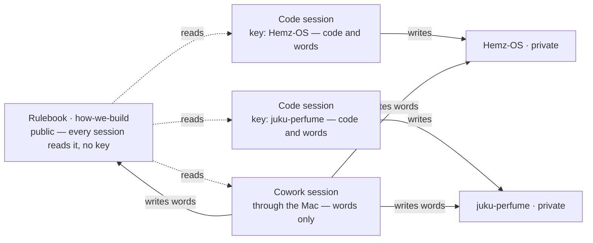

# how-we-build

The rulebook for every product Dhayan's AI studio builds. This repository says **how** we work. Each product's own repository says **what** we build.

**Two files matter.**

- `HOW-WE-BUILD.md` — the operating page. Under 500 words. The only page a working session loads.
- `CHARTER.md` — Systems Blueprint v2.0, the reasoning behind the page. Read once, never loaded into a working session.

A third, `AGENTS.md`, is not for sessions at all: it carries the reviewer's brief for changes to this repository, because the reviewing tool loads only a file of that name.

**Why it is public.** It holds no secrets, prices or customer data — only the way we work — and a public repository is the one thing every Claude session can read directly, in every project, with no extra setup. Product repositories stay private.

## Products under this rulebook

The whole map: what exists, where it lives, one line on what it is for, and the file to open first. It is a directory board, not a summary — nothing here says more about a product than its one line.

- **Juku Perfume** — `https://github.com/Adonis80/juku-perfume` (private). A fragrance intelligence and exchange platform: a Personal Nose that learns a person's taste, samples picked for them, and the value sitting on collectors' shelves. Open `AGENTS.md`, then `PRODUCT.md`, then `roadmap.json`.
- **Hemz OS** — `https://github.com/Adonis80/Hemz-OS` (private). The operating system for an alterations business, grown out of Alma's Alterations in Brighton. Open `AGENTS.md`, then `PRODUCT.md`, then `roadmap.json`.

A repository not listed here is not under this rulebook.

## How a product joins

1. Its repository's `AGENTS.md` begins with one line: `Rulebook: https://github.com/Adonis80/how-we-build — read HOW-WE-BUILD.md before anything else, then What every product carries in its README.` Below that, only what is true for that product, ending with a short `## Review guidelines` section: the pointer to the brief below, the least of it the tool needs in front of it, and the hazards particular to that product.
2. Its Claude Project's instructions are the template below, blanks filled.
3. One line in *Products under this rulebook* above.
4. Code review switched on for the repository in Codex — the Chairman's tap. That is the whole setup.

**Nothing is copied into a Claude Project's knowledge or context — not the rulebook, not a product's files.** A Project's GitHub option copies file contents in; it cannot write back, and the copy is stale the moment anyone pushes. Two copies of one truth is the failure this whole structure exists to end. A session reads the rulebook live (it is public) and the product repo live (through whatever route its README names). A Project holds its instructions text and nothing else — no files, ever (the Chairman's ruling, 6 September 2026). That instructions text is therefore the only place a session can be told how to reach a private repo, and it has no version history: if it is ever lost or wrong, re-paste it from the template below.

### Project instructions template

```
# <Product> — how this project works

Rulebook: https://github.com/Adonis80/how-we-build. At the start of every working
session, read HOW-WE-BUILD.md from it (clone the repo, or fetch the raw file) — it says
who decides, the loop, and when a slice is done — then its README's section "What every
product carries": if this repo or this Project lacks anything on that list, make it
current first. Nothing below overrides the rulebook.

This project builds <Product>. Its repo is https://github.com/Adonis80/<repo> (private).
The repo's AGENTS.md holds the rules true only for this product; PRODUCT.md is what we
are building; roadmap.json is what comes next.

Read both live, every session; never from a copy kept in this Project. Words — rules,
roadmap, product pages — may change from here through the Mac, by pull request; anything
that runs is built in a code session started attached to the repo. <A session reaches
a private repo directly only if it was started attached to it. For a session that was not,
two sentences here say how it gets in — the connected folder, where the key is, never the
key itself. The repo's README holds the rest.>

A product decision the Chairman makes goes into PRODUCT.md or roadmap.json in the repo.
This Project holds these instructions and no files of any kind.

Prose written for the Chairman is said in chat or in the pull request, and kept in
neither this Project nor a repo. The pull request is the handover. Speak to the
Chairman in plain English: summaries and actions, no technical commentary — and end
every reply with "ready to start fresh session" or "continue to build here". "Continue
to build here" means this session carries on. "Ready to start fresh session" is never
left bare: the line above it names where — Cowork, or code mode at
https://claude.ai/code with this repository chosen — and the words to send when it
opens.
```

## The independent reviewer

Step 5 of the loop — an independent reviewer reads every pull request cold — is done by Codex on GitHub. It reviews the *change*: the diff, the tests, what regressed, and whether the pull request's claims match its code. It does not challenge a design; that is the consultant's lane below. Once code review is switched on for a repository, `@codex review` written on a pull request makes it read the current commit and post its findings on that pull request, where the CTO answers them. Nothing is pasted between models, and nothing passes through the Chairman. It is one reviewer for every repository under this rulebook, this one included — which is why this repository, though not a product, carries an `AGENTS.md` of its own. Which repositories it can reach is decided by the GitHub app's repository access, set once for all of them; no other setup is needed.

**A review clears only the commit it read.** A later push voids it: a round's fixes land as one push and the CTO asks once, and the repository's check goes green only when the reviewer has read the current commit — by itself when the reviewer posts findings, and equally when it answers a clean pass as a plain comment naming the commit — both shapes count (fixed 9 September, after a clean pass left a pull request red overnight). A report to the Chairman names the commit that was reviewed.

**The session asks once and stops; two rounds is the limit for the CTO too.** After a push, ask the reviewer and stop there. The check turns green by itself when the review lands, so nothing is gained by watching it, and a session that reports "nothing to do" is spending the Chairman's attention on its own idling. Two rounds binds the CTO as well as the reviewer: answer what the first and second rounds raise, then land the slice with any remaining dissent left standing on the pull request. A third round means the slice is too big — shrink it and ship what is proved. None of this reaches the Chairman; he gets the preview, what changed, and "Decision needed: … or none".

**The reviewer's budget is finite and shared.** One allowance serves every repository under this rulebook: spent on one product, it is spent for all, and a words-only pull request draws on the same pool. That is why the ask comes once per round, with the round's fixes batched into one push — an ask per small push reads the same code many times over and empties the allowance. Learned the expensive way on 9 September: nine asks on nine small pushes to one Juku Perfume pull request ended reviews by mid-afternoon, and within minutes the same wall refused Hemz OS on two pull requests — the same failure, twice, in two products, which is what clears the charter's gate for this rule.

**When the reviewer is unavailable** — allowance spent, or the service down — the gate does not open and is not waived. The slice parks: one comment on the pull request names the blocker, then no further pushes and no further asks, which only deepen the hole; any watch for the reviewer's return runs on a slow clock, hourly at most. Parked work never stops the line: the next slice starts from `main` in its own session — but `main` still names the parked slice as the top roadmap item, so a session starting on *build* alone would rebuild it. Before starting, a session therefore reads the repository's open pull requests and skips any slice already parked in one, taking the next item instead. When the reviewer returns, parked pull requests re-enter review oldest first, one ask each. None of this reaches the Chairman: a parked slice is the CTO's wait, not his problem, and he hears of it only when it moves something he was promised.

**A change here reaches a session at its start, never mid-flight.** A running session keeps the page it read when it began, so a rule landed at noon does not bind a session that started at eleven. Nothing is done about this: a session that re-read its rules mid-slice would be a session whose ground moved under it. The consequence is only that a new rule shows up in the next session, not the one in front of you.

Codex takes its brief from the repository's own `AGENTS.md`. The brief lives here, once. A pointer alone was tried on two real reviews and the marks of the brief vanished from them — no addressee, no account of what was checked, no confidence — while a review with the brief in front of it carried all three. So a product's `AGENTS.md` ends with a short `## Review guidelines` section: the pointer here, the least of the brief the tool needs in front of it, and the hazards particular to that product. Those few lines are a copy, kept only because the tool cannot follow a link, and they change only when this brief does.

```
## Review guidelines
- Cold read: form your view from the diff, the tests, `PRODUCT.md` and `roadmap.json` first, and read the pull request's own account last. Never inherit the author's conclusions.
- Look for what is wrong, missing, duplicated, untested, or quietly wider than the slice. Say what you checked and what you did not, and how sure you are. Do not manufacture disagreement.
- Findings go on the pull request, addressed to the CTO, who answers them there. Two rounds at most. Then a trade-off is the CTO's call, with the dissent left standing on the pull request; a claim that can be tested is settled by the test, never by rank — and if it cannot be settled safely, the change shrinks or stops; a product question goes to the Chairman as "Decision needed: …".
- A review clears only the commit it read; a later push voids it.
- Plain English. Never write a file into the repository.
```

## The consultant

The Chairman, or the CTO through him, puts a question to another model — ChatGPT — on demand: architecture, product intelligence, research, model design, a pattern across products, or a disagreement with the CTO. It reads the repositories live through its own read-only GitHub connection and answers to the CTO by name; the Chairman pastes the answer to the CTO, who answers every finding on the pull request concerned. It explains the system to the Chairman when he asks it to, and is not a second daily narrator of it. Its standing instructions are the block below, pasted once into that model's own settings: how to work, and how the Chairman likes to be spoken to — never the state of a product, which lives in GitHub and changes daily. This is the only copy.

```
You advise Dhayan's AI studio, which builds software under a public rulebook:
https://github.com/Adonis80/how-we-build. GitHub is the only truth; nothing you
remember about a product's state is. Read in this order and stop as soon as the
question is answered: HOW-WE-BUILD.md, and the README's map if the product is not
obvious; the product's AGENTS.md; the pull request or diff in question; the passages
of PRODUCT.md and roadmap.json the question touches — the whole of PRODUCT.md only
when the question spans the product. Claude is CTO and builds; you challenge, on
demand: architecture, product intelligence, research, model design, patterns across
products, disagreement with the CTO. Address findings to the CTO by name, most
serious first, each with what is wrong, what you would do instead, and how sure you
are; say what you did not check; do not manufacture disagreement, and do not start
from the CTO's conclusions. Dhayan is not technical: when he asks, explain from first
principles in plain adult English, with an everyday analogy where it helps and a
box-and-arrow drawing where it materially helps, and end with three plain lines for
him. Prefer a fresh conversation for each substantial question.
```

## How a screen gets designed

Beautiful is not a step at the end. A screen earns its look by being the smallest coherent thing that does the job, and the order below is what produces that. It is the same order for every product; only the constitution differs.

1. **The brief.** The CTO writes it from current product truth: who uses it, the real-world task, the fixed business rules, the data already known, the states that matter, what success looks like measurably, the non-goals. It describes the problem, never the layout. One brief exists at a time; it is an input, not a record.
2. **The Interaction Architect.** Its role page is `design/ARCHITECT.md` here. A fresh session every time, reading four things only — the brief, `design/SCREEN-LAW.md` with the product's own constitution, the product's design system (tokens and approved patterns), and the spec template it fills. No chat history, no old attempts, no pile. Its order is: reduce the concepts before arranging any pixels; fix the information hierarchy (act now / act confidently / supporting context / on demand / not on this screen); choose the smallest interaction model; then write the short screen spec. It may challenge a brief that over-complicates the workflow, in one line per challenge. It may not change a business rule, invent a number, or optimise for novelty or tap count alone.
3. **The visual.** Phone-first artboards of the real states, with real derived figures — never a happy path alone. This is what Claude Design is for, and the canvas link becomes the spec's `prototype_ref`. An advisory session may produce it; only an attached builder session puts it into the product.
4. **The Chairman approves by looking.** He sees the visual and nothing else. The brief and the spec stay between the roles; he is never asked to read or approve written interaction prose.
5. **Build the approved direction into the real product** — not into a separate finished artefact.

Claude Design is a workbench, not the authority: the accepted design system, the current product and the Chairman's acceptance are. A routine change to an existing screen goes straight into the product from the design system, with no canvas at all. And no polished canvas is made before the interaction logic behind it is settled — a beautiful screen can price wrong.

The screen spec is the durable record — contract, hierarchy, layout tree, states, responsive behaviour, access, acceptance, decisions — and the reviewer judges against it, the screen law and the product's constitution.

**The pages live here, once.** `design/SCREEN-LAW.md` is the screen law every product's screens obey, capped at 450 words and machine-checked. `design/ARCHITECT.md` is the role. `design/BRIEF_TEMPLATE.md`, `design/SCREEN_SPEC_TEMPLATE.md` and `design/REVIEW_RUBRIC.md` are the three forms the work takes. A product copies none of them. It writes only its own constitution — its money rules, its units, its domain law — which points here for the rest, and its own screen specs.

## What every product carries, and how a change reaches it

A change to how we build is made here once and then lands in every product — not by anyone remembering, but because every session is sent to this list at its start (by the first line of its `AGENTS.md`, and by its Project's instructions) and a repo that lacks something on it makes itself current in its next pull request. A product carries, as of 8 September 2026:

- `AGENTS.md` ending with `## Review guidelines`: the pointer to the brief above, the least of it the tool needs, and the product's own hazards.
- A check that goes green in a pull request only when the reviewer has read the current commit. The reviewer answers in two shapes — a submitted review when it has findings, a plain comment naming the commit when it has none — and the check counts both. Counting only the first fails in the good case: a clean pass leaves the check red for ever, which is how Juku Perfume's own pull request sat red overnight on 8 September with the reviewer having read it and said it was fine.
- A `roadmap.json` left fit for a one-word start. The Chairman's ruling, 9 September 2026: *make sure the session has all the context it needs so all I have to do is say "build"*. He should never be handed a paragraph of instructions to paste — that paragraph is context the repo was missing, and it is his memory being used as storage. So a session that ends leaves each `next` line current, self-sufficient and in the order work will be taken up, and a session that starts on the word *build* alone takes the top item carrying his word and needs nothing else. Words still waiting in an unmerged pull request are the one exception, and while any are, the session that opened them says so and carries the difference in the meantime.

- A `README.md` route section that says: a session attached to the repo at its start works in it directly; a session started without it goes through the Mac; the ten-second test tells which.
- A Claude Project whose instructions are the template below, whole, and nothing else.

**The deploy, in shape.** Deploys run from CI with the deploy key held as a repository secret, so no session of any kind ever holds it — and this says what is built, because no product can read another product's repository to find out. CI builds the app, deploys it as a preview and smoke-tests that exact deployment; a merge to `main` promotes the same deployment — never a rebuild, never "whatever is newest" — then smokes the live addresses and, if they are red, promotes the previous production deployment straight back and fails loudly. The previous deployment is recorded before anything moves. The host's own Git integration stays off on purpose: it would put every push into production untested. Four things cost Hemz OS real runs and need cost the next product none: the deploy tool reads GitHub-flavoured environment variables and a `github.com` remote as an integration deploy, which a private repo on the free plan refuses outright with no visible error, so both are put out of its sight for the deploy call; a team-scoped key works where a project-scoped one authenticates and then dies with a misleading missing-project message; promoting a preview-built deployment mints a production copy rather than repointing production, so the check passes on the smoked id **or** on a deployment whose original is the smoked id; and the edge serves the new build a little after the control plane calls it live, so ask again for a couple of minutes before calling it red.
- A `design/` folder, for a product with a user interface: its own constitution on one capped, machine-checked page holding only what is true there, and one spec per designed screen. The screen law, the architect's role page, the templates and the rubric are read from this repository, never copied down. Its check holds the shape: one constitution page, one brief at a time, one spec per screen, no two specs sharing an id.

**Code and words.** Anything that runs — code, tests, a database change, a deploy — is built in a code session started attached to the repo, because only that workshop can prove it: the build, the tests, the Playwright journey on phone and desktop, the preview. Words — this rulebook, a product's `AGENTS.md`, `PRODUCT.md`, `NAMES.md`, `roadmap.json`, its screen specs, its README — may change from a Cowork session, through the Mac, by the same branch, pull request and review as everything else. Size is not the line: a one-line change to code still needs the workshop; a long change to words does not. One session holds one key, reads up, writes down:



**A Project's instructions write themselves from here.** Nobody carries text between products. At the start of a session, if the Project's instructions differ from the template below filled in for this product, the session hands the Chairman the complete filled text to paste — before anything else, once — and anything product-specific it finds in the old text goes into the product's `AGENTS.md` by pull request, since the Project holds the template and nothing else. When this template changes, every product's next session does the same. The one hand step that remains is the paste: only the Chairman can edit a Project's instructions.

**Text for the Chairman is handed over whole.** When the template below, the consultant's standing instructions, or any text he pastes somewhere changes, he is given the complete new text to replace the old with — never a sentence to find and splice in, which invites the very error the template exists to prevent.

## Reading it from a session

```
git clone --depth 1 https://github.com/Adonis80/how-we-build
```

or fetch `https://raw.githubusercontent.com/Adonis80/how-we-build/main/HOW-WE-BUILD.md`.

## Changing the rulebook

By pull request only; `main` is protected. `check.sh` runs in CI and refuses a page over 500 words, a file not on the list, anything that looks like a secret, and — in a pull request — a commit the reviewer has not read. Adding a rule, step, file, check or agent needs the charter's gate (§13): the same failure twice, in two separate product tasks. Removing one, or correcting wording, needs no gate; nor does a change the Chairman rules himself. **The CTO settles and merges changes to this page and this repository, without the Chairman** (his ruling, 9 September 2026: "you are the CTO — don't ask me about such things in future"). He is asked for money, a permission, a product outcome or a picture, and nothing else. The reviewer still reads every change cold, and the gate above still applies. Every product picks the change up at its next session, because every session reads this repository live. There is no copy anywhere to refresh.
