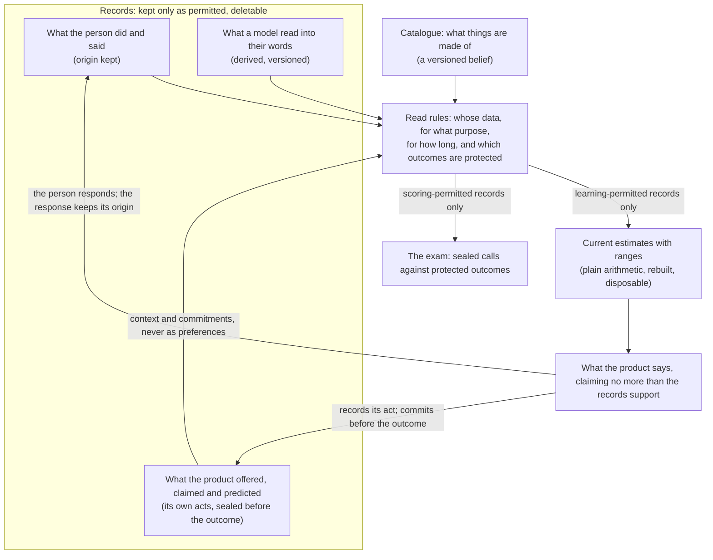

# Rich data

**How a product's AI gets smarter in its domain, and how we know it did.**

Read this page only when your slice changes what a product learns from, shows about a person, or claims about its own accuracy. Ordinary slices do not load it. It is the method every product follows; each product's own `PRODUCT.md` says how the method applies there. Agreed with Astra over four rounds, September 2026. Nothing on this page is an automated check: the proof lives in each product's tests, in the slice that changes the behaviour.

---

## 1. The goal

The Chairman's ruling, 17 September 2026:

> Juku OS goals are to develop world class software, and to always look to identify and capture rich data for training and improving AIs over time.

> Each project is optimised for collecting rich data, that can be used for increasing the intelligence of the project native AI. so the project AI becomes more and more intelligent in that domain over time.

**Rich means granularity, not coverage.** Existing databases in every domain collect one-dimensional verdicts on finished things: a rating for a perfume, a price for an alteration. We collect a far finer understanding of each individual: which qualities, in which combinations, under which conditions, at which point in time, and how sure we may be.

---

## 2. The principle

Think of a detective. A detective does not get smarter by asking the suspect five hundred questions. They get smarter from receipts, timings and camera footage, and by asking the one question whose answer would change the case.

So: **the world records verdicts; we record the circumstances of the verdict.** Every domain has an outcome made of parts, judged under circumstances. A perfume is its notes, worn on a certain skin at a certain hour. An alteration is its operations, done on a certain fabric under a certain deadline. Others record the verdict. We record the parts, the circumstances, and what we guessed beforehand.

Three sentences the whole page rests on:

- **The diary is the asset, not the portrait.** Keep every line of what happened. Repaint the understanding from those lines whenever we like. Keep only the portrait and you can never repaint it, explain it, or undo a mistake.
- **More data cures noise, not bias.** Ten million records of people who chose something tell you about the kind of people who choose it. Only a fair test tells you what the thing does.
- **Intelligence comes from contrast, not width.** Many observations per question, not many questions per observation. At our scale, extra columns with no extra contrast make the AI find patterns that are not there, and state them with confidence.

And the loop that makes an AI cleverer (the product does fit numbers from evidence; only the language model is never fine-tuned on people's data): it commits to a call before the outcome exists; reality answers; it finds out how wrong it was; the belief updates and the diary grows. A prediction never written down beforehand can never be scored afterwards, at any price.

---

## 3. Start at the destination

Before deciding what to capture, write one paragraph: **the richest evidence this domain could hold at scale.** Then work backwards to what to capture from each person, and in which order. The order is the design rule below. The dialogue with a person may range as wide as the declared purpose allows. The limits are the declared purpose, the never-infer list (§8) and the design rule (§4): necessary, explainable, authorised, and asked in the order most likely to change a decision. Within that purpose there is no artificial cap on how much the AI may come to understand about a person.

---

## 4. What rich evidence is

Seven properties, roughly in order of power.

1. **Things held still.** Same person, same thing, different season. Same operation, different fabric. One thing moves, everything else fixed. One person's tenth wear teaches more than ten strangers' first.
2. **Comparisons, not scores.** "This over that, same sitting" survives people being generous or harsh. Comparisons are first-class records, not a note on a score.
3. **Overlap.** The same person meeting many things, and the same thing met by many people. A thousand people rating one thing each teaches nothing; a hundred rating twenty each teaches a great deal.
4. **Surprises earn a second look, not a big move.** A surprising reaction is neither automatically a large update nor automatically noise. Read it against uncertainty, origin and conditions. A repeat may clarify it; no programme of re-sending samples is authorised by this page.
5. **Contrast.** What was offered and passed over, skipped, considered and rejected. This needs a record of what the product offered (§5), or "never saw it" and "saw it and passed" are the same silence.
6. **Conditions attached.** A reaction carrying its circumstances answers several questions at once.
7. **The kind of action.** Distinguish a stated preference, an experienced reaction and a consequential action (bought again, finished, paid). Record the kind. Where a product weighs a costly action above a statement about the same thing, that weighting is a documented, versioned starting assumption, tested like any other, not an imposed order of truth.

**One clue, many parts.** One judgement of a whole thing is one clue about all its parts at once, not a reading of each. Parts come apart only across different wholes that share some parts and differ in others, met by the same person or by people whose evidence may be pooled with theirs. Eleven wears of one bottle are eleven reactions to one item: good for repeatability and changing conditions, not eleven contrasts between parts. Parts that always travel together in the available evidence are one variable: keep their catalogue identities, publish no separate learned effects. Begin with a small set of qualities a person can actually perceive (sweet, powdery, smoky, fresh), by phase (opening, middle, drydown), and admit finer distinctions and pairs only when evidence demands (§6). Neither a published note nor a quality inferred from a whole-item rating is a direct measurement of what that person perceived; label both accordingly.

**Worth least, so no effort goes there:** people's explanations of their own preferences; free text; one-off ratings from people who never return; anything gathered under conditions that were not recorded.

**The design rule.** Ask for information likely to change a useful decision. Do not ask again for what is already reliably available for that permitted purpose. Do not introduce observation merely to avoid asking. Capture only what is necessary, explainable to the person, and authorised. Temporarily withholding a prediction under the evaluation rules (§7) is not concealment of the processing itself.

---

## 5. How it is captured

**A conversation that makes claims and gets corrected**, with these rules:

1. Every claim the product shows a person is logged as a product act (below).
2. Every reply is marked *volunteered* or *prompted by our claim*.
3. A yes prompted by our own claim is a prompted statement, never independent support. Explicit preferences and corrections may guide service immediately without counting as evidence that a prediction was accurate. A later rating remains a self-report with its own exposure history.
4. The better claim is concrete: a choice between two things just worn, tested by the next rating rather than by the yes.
5. A person's edited preference and the product's estimate stay distinct. Respect the person's constraint without rewriting earlier reactions. Where both are shown, say "your stated preference" and "our current estimate from your wears"; the latter is never presented as the truth about their taste.
6. The evidence store never holds a person's free text. Permanent lines hold closed-list fields only. A structured reading of what someone said is a derived result, stamped with the reader's version, allowed to return *unknown* or *ambiguous*, never stored as if the person said it, and produced by the reply the conversation already makes (no extra model call). A person's confirmation of a reading is a separate stated event. If the product keeps conversations at all, that is under their own stated period; "stored once" never means indefinitely. No free-text copy leaks into an explanation, a log or a model's numerical fingerprint of the text.

**Use what is already reliably recorded; ask only for the rest.** Record application time and reaction time when known, each marked live or reported afterwards; elapsed time is derived, and opening, middle and drydown are declared, versioned approximations from it, not measurements. Longevity is recorded as checks, not durations: applied at, checked at, clear / faint / gone; unanswered is missing, never gone; a later check may reverse an earlier one; "gone" means gone to the wearer. Hold conditions once only when they are truly shared (§6).

**Coded samples**, where the Chairman approves them: the person rates, then the reveal of name, price and the sealed prediction. Record that presentation was coded and whether recognition is known or unknown. A code removes name-and-price cues from our presentation; it does not erase earlier recognition or external knowledge, and a claim about a smellable quality still counts as exposure (§7).

**The product's own acts are evidence.** Record the act the product can establish: selected, dispatched, displayed, or another already-observed state; never "seen" without evidence. For every offer: the set, the order, the role (§7), the policy version (which version of the picking rule was in force) and the catalogue version, by stable reference. Claims are recorded as approved structured claims with their displayed values or template versions, never as copies of conversation. Where an item was drawn at random, record the chance it had, with the eligible pool and the draw rule that define that chance. Explicit skip, explicit rejection and no recorded response stay distinct, and none supplies an unspoken reason. Unverifiable exposure is unknown, not unexposed. A product act is context, selection accounting or a frozen prediction; it is never a preference label, and the product's own prediction is never evidence that it was right.

**Hemz OS.** Timings come from taps that already do work in the workflow, marked tapped live or entered after. A single-operation job measures only its recorded interval, which may include setup, waiting and interruption; the closed distinction between elapsed time and active work stands. If counter transactions during a job are already captured and permitted, they may supply a labelled proxy for interruption in retrospective analysis; they prove nothing about who stopped or for how long, are never subtracted from elapsed time, and never feed a prediction made before the job. Otherwise the field is omitted; no new monitoring workflow.

---

## 6. How it is stored

**Three kinds of record, behaving differently.**

| Kind | What it holds | How it behaves |
|---|---|---|
| Records | What the person did or said; approved model readings (derived, versioned); the product's own acts: offers, claims, sealed predictions | Kept only for a permitted purpose and period. Never edited. Deleted on erasure, expiry or a shop leaving |
| Catalogue | What things are made of, and the shared vocabulary of a domain | A versioned belief, added to and never overwritten |
| Derived | Strengths with ranges, profiles, patterns | Plain arithmetic, rebuilt on demand, disposable, invalidated before serving |

**One line per thing that happened.** Never edited; a correction is a new line that supersedes the old. Each line carries its origin (a person's statement, a recorded observation, a derived result), who recorded it, when, and the version of the notice and terms in force at capture; in Hemz, also the shop and its agreement version. The notice stamp is where the record came from, not permission: the purpose and the legal ground that permits it must be traceable, and where consent is relied on, the choice and any withdrawal are recorded. Current restrictions govern current use of old records.

**A line points at the exact thing.** Variant, concentration, batch or year where known, because a reformulation under the same name is a different thing. It does not copy the thing's parts; those are joined when strengths are computed, so a better catalogue improves every old line. The line carries only what cannot be looked up later, and a missing amount, site, batch or perspective is left missing, never invented.

**The catalogue is a belief.** Published note lists are marketing. Entries carry origin and version; fields distinguish *not listed*, *unknown* and *known absent*. A changed catalogue may inform a new computation over retained evidence; it never rewrites the inputs, claims or prediction committed in an earlier evaluation. Current interpretation and as-made decision history are separate views. In Hemz the catalogue is ours: a shared vocabulary of operations, garments and fabrics, authored as generic trade names, holding no shop's times, prices or techniques. Each shop names and prices its own menu; a menu line maps to one or more shared operations, with quantity and unit where they already form part of the job, or is explicitly unmapped; an ambiguous bundle is never forced into one operation to make the field look complete. The menu and its mapping are versioned. The mapping must exist before a second shop configures a menu, and it is not permission to pool data: every variable carries a scope, this shop or all shops, defaulting to this shop, and promotion is a human decision under a permission not yet held.

**Conditions held once, at the level they belong to.** The thing record: identity, concentration, batch, supplied applicator. The sitting: conditions that are truly shared (strip, skin or fabric; how many were tried), with a per-wear exception where they differ; presentation order only when the interaction establishes it, never inferred from entry times. The person record, dated: coarse home region and self-described perfume behaviour, kept only while the declared product purpose needs them, and never as a location history. Date-derived conditions (season, weekday, daylight) with the calendar convention stated, as broad approximations, not observed weather or indoor conditions; weather is deferred. On the line: only what is unique to the moment (amount, site, named or coded, volunteered or prompted, whose reaction about what, repeat of, pair and side). **No per-line location, ever.** A known away-from-home wear has unknown conditions. Any home-based assumption is labelled as one, never stated as observed.

**Whose reaction about what.** Mine on me, mine on someone else, and what a scent says about its wearer are three questions, never one field. Another person is recorded only as an unnamed role, only when the distinction is necessary, and never as a profile.

**Never edited is not never deleted.** A random key per person (per shop in Hemz), never derived from an email address. Erasure deletes the lines and the link to the name, together with application logs and any other retained personal copy, and takes effect in one all-or-nothing step that also invalidates every computed output depending on them, including cached profiles and saved copies; nothing computed from them is served again; rebuilding happens on the next permitted read. The automated test that re-runs on every change: delete a subject, exercise the read path, rebuild, assert that the deleted inputs and every subject-specific record are absent. It is evidence for the paths it exercises, not for untested systems. Backups are put beyond use until their stated expiry, and restoring one must not revive erased data. Supplier retention and training settings are verified against the actual configuration; until then "the provider keeps nothing" is a requirement, not a fact. Because derived is rebuilt, a person's contribution is gone once outputs are rebuilt, with no special machinery, though not every historical indirect influence on design or policy choice.

**Derived is disposable.** Strengths are computed by ordinary code, never by a language model; the model talks about them. A saved copy exists only for speed, references the method, catalogue, variable-set and permitted-input versions, and is invalidated by deletion, correction, expiry or a change of permission before anything is served. A model's reading of a person's words is kept only where it is an input or accounts for an actual product act, marked derived with reader version and source reference, under its own period. Protected evaluation outcomes, and anything derived from them, stay out of learning inputs, including the examples and context fed to the language model for later predictions. Rebuilding changes today's estimate; it never restates yesterday's sealed prediction.

**Every strength carries honest support.** Support is the number of distinct things with the part, without it, and unknown, distinguishing people from wears where evidence is pooled; it describes coverage, not identifiability. Every strength starts at a documented, versioned starting assumption and is pulled away from it only by evidence, with fixed conservative settings for the first slice; a defined zero is a starting assumption, not neutral liking. Every strength carries a range whose target and method are stated (uncertainty in a preference is not the predictive range for a future rating); where no defensible range exists, show unknown and speak tentatively. Below a support floor the product's language is forced tentative and the item is treated as a question. "Your strongest" lists are built only after estimates have been pulled back towards the starting assumption, or they select the noisiest. Early strengths are largely starting assumptions, and the screen says so. Every recommendation names the layer it stands on: this person, people like them, everybody. Empty wider layers stay empty.

**Variables grow by a gate.** Adding or changing a variable is a policy change. Freeze its definition, the incumbent it is compared with, the outcome, the decision rule and the evaluation window before looking at fresh protected outcomes. One candidate at a time; inconclusive means not yet; a consulted evaluation set is never fresh again; admission evidence is reported as such. Three tests beyond the score: a person can perceive it; the product can say it in a sentence; it is not on the never-infer list (§8). A new thing the product would learn *about people* is put to the Chairman as one plain sentence, agreed or not yet. Removal for safety, privacy, invalid data or withdrawn permission is immediate and never waits to win on accuracy; removal for performance follows the same gate; removal invalidates dependent outputs.

---

## 7. The exam: how we know it got smarter

**Every prediction is sealed before the outcome exists**: the call, the range the product stated (with its target, coverage level and method version), the policy version, the variable-set version and the permitted inputs it used. It is never overwritten or relinked. How often ratings land inside the stated ranges is reported together with how wide those ranges were, so vagueness earns nothing; a qualitative label is not a probability. An outcome the product never predicted is still welcome as evidence; it simply stays outside the exam.

**Three roles, fixed when an item is chosen, recorded, never signalled per item, and explained in general terms in the notice**, which is never permission to hide processing or refuse lawful access.

- *Evaluation*: drawn at random from a pool defined by declared eligibility constraints, never by the model's scores or a score-based shortlist; the draw rule and its probability recorded. Its outcome is **protected for life**: it never enters learning inputs, the profile, the examples or context fed to the language model, or any adjustment of the picking rule, whatever later happens to it. Holding back a slice of the model's own top picks does not qualify.
- *Learning*: random or belief-directed exploration, chance logged where random, never in the evaluation denominator. Without it the evidence only confirms itself, so the nudge is structural, not occasional.
- *Service*: picked for the person.

**Claims leak.** A claim shown to a person before they rate is a fit explanation leaked early. The relevance rule is frozen when a candidate is presented, from versioned catalogue descriptions and claim records, and applies to every relevant exposure until the first rating is committed, including profile and conversation displays in between. A rating committed after a relevant claim leaves the headline figure and is reported by its exposure state; it keeps its original role, so an evaluation outcome stays protected regardless. Unknown exposure is unknown, not absent. No invented numerical correction for anchoring. The more the product tells a person about themselves, the fewer of their ratings qualify; that consequence is stated beside the figure.

**Honest accounting.** Assignment, presentation, rating, skip, exclusion and erased states reconcile without double counting. A skip is no preference. Erased is a bare, non-identifying tally in the original accounting unit, incremented once in the deletion step, with no subject, item or timestamp, and no fine-grained breakdown kept just to reconstruct the total a figure is measured against. Erased or unavailable observations are reported separately from the number still scoreable, never shown as a success, a failure or a hidden omission. Report the eligible population and response coverage; a figure from responding participants is not a claim about everyone.

**What proof looks like.** Nothing is called an improvement until it beats a stated baseline on protected outcomes, with the promotion and rollback rule agreed in advance, and no scheduled refresh, autonomous promotion or background watcher. The intelligence is the gap between the product and a plain baseline such as recommending what is popular: **no gap, no intelligence.** Beside the gap, report observed repeatability (how far people agree with themselves on matched repeats, with sample size and conditions), called repeatability and never a ceiling; a changed-condition repeat is analysed as the first property, not as noise; no re-sending programme is authorised by this page. Unknown is a valid value. No public accuracy figure until its population, period, denominator and uncertainty are specified in advance.

**Hemz OS.** The estimate, the rule and version behind it, and the context known at that moment are stored before work begins, separate from later scope changes. The actual duration is stored with its measurement basis. Rework is three-state (reported / none reported within the observation window / observation incomplete) and never invented. The estimate is visible to the operator because the shop runs on it, so anchoring (a shown number pulling the recorded answer towards it) is a standing limitation recorded beside the figures. The operator can tell the original estimate from the measured actual and see whether the comparison is valid; missing timing stays missing; an empty comparison never shows a reassuring zero. What Hemz learns is prediction (how long will this mix take, here), never attribution of time to a part or a person. Who did the work stays in access-controlled job documentation under its existing clearing rule and is never copied into estimation evidence or ranked. The first slice uses only currently permitted records, retains no trend, and says so; support per operation-by-fabric combination is measured from that window, and its size is presently unknown. Learning across cleared history and any month-on-month proof wait on the Chairman's retention decision; cross-shop learning waits on the separate authority for staff expertise. A retained error summary could one day support a trend; it would not preserve the evidence needed to refit a better model.

---

## 8. What must never be learned

Each product keeps a fixed never-infer list, and only approved fields and values enter the learning record, claim records and model-derived fields alike. Prohibited attributes are neither retained, derived nor approached through proxies. Skin is recorded only as self-described perfume behaviour. Hemz measurements stay in the job documentation that clears and never become evidence. Sensitive content a person volunteers in conversation follows that conversation's assessed handling rules; excluding it from the evidence store does not make its transient processing disappear, and no new purpose is granted by that exclusion. Extraction is validated against the approved fields using the reply already being made.

---

## 9. Legal prerequisites, named and not solved

These are the controller's responsibilities, taken with legal advice. Technical consensus grants none of them.

- Each product completes its impact assessment before the first real-person processing it covers, assessing the actual profiling, learning and evaluation operations; unresolved high risks are recorded and the required steps taken before proceeding.
- The notice describes the operations actually performed: storing reactions, calculating a personal profile, evaluating recommendations, and improving recommendations for other people only where approved and lawful. It never calls retrieval "training" and never promises there is no training when numbers are fitted from evidence. The language model itself is not fine-tuned on people's data; that is a separate, deferred decision.
- Wider commercialisation, external model training or any materially new use returns as its own proposal with its own notice and legal ground. No speculative field is kept to preserve the option.
- In Hemz, for processing done solely on a shop's documented instructions, the shop decides why the data is used (it is the controller) and we act only on its instructions (we are its processor); that is a legal assessment, not settled here, and learning for our own improvement purpose needs its own role and legal-ground assessment, even within one shop. Any accounting or legal retention the shop must keep stays segregated and never becomes learning evidence. Staff receive clear written information before any timing begins: purpose, access, use and retention. Notice or agreement is not by itself a legal ground for monitoring.
- Myst's 18+ intention needs a proportionate assessment of whether children are likely to use it and what follows; a declaration alone does not settle it.
- Removing a name does not make a record anonymous. With two or three workers, aggregation guarantees nothing. Any retained summary in Hemz is treated as staff personal data unless shown otherwise, and any retained job line is minimised personal data for a stated purpose and period, never "anonymised".

---

## 10. What every product page carries

`PRODUCT.md` has a section with these five headings, filled proportionately; *unknown* and *deliberately not captured* are valid answers.

1. **The destination, the whole and its parts.** The richest evidence this domain could hold; what the outcome is made of.
2. **The ladder, and the rung we are on.** Each rung with its gate named where one exists.
3. **The loop.** What the AI commits to before the outcome, and what reality answers.
4. **What is captured, what deliberately is not, and under which notice.**
5. **The proof.** Measure, baseline, repeatability, current figure or "unknown".

Every pull request handover states what evidence the slice captures or deliberately does not capture, which decision it can improve, what cost or retention obligation it adds, and under which notice. "None, because ..." is a valid answer.

---

## 11. What this is not

No universal capture service, shared runtime or developer-facing index over our own repositories. No population modelling before there is a population. No fine-tuning, no loading of videos or podcasts as evidence, no special defence against deliberately corrupted input, no new paid service, outside data source, scheduled job or extra model call to populate the loop. No automated repricing, staff-performance surface or causal claim from observational timing. A field is not a capability: accurate exposure capture, versioned mappings, constrained extraction, protected-data exclusion and cache-and-deletion enforcement need implementation and a passing test, not a column. Do not claim a capability exists because its schema has a column.

---

## 12. The drawing

The read rules are ordinary application code, not a shared service. Recording an act is not permission to keep it beyond its period.
