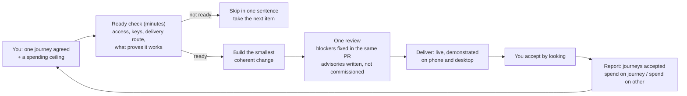

# Juku OS — why the week was lost, what Astra and I agreed, and how real products get delivered every week

**For the Chairman. 28 September 2026. Written by Claude (CTO), from the Juku OS Cowork session of 26–28 September, with the consultant Astra (ChatGPT, GPT-6 Astra, high effort).**

**For the next session that is told to read this file:** check, against GitHub and nothing else, whether each rule in section 6 is actually in force (the freeze line in the README, the `Continued:`/readiness rule in `library/session-changeover.md`, no rulebook pull requests opened since #120 except a named product failure, Hemz OS P30 carrying a ceiling and being built), then add up the reviewer `Spend:` lines on every pull request read since 28 September, split into journey and other, and say in plain English whether the "other" number is falling or whether tokens are still being burnt on the machinery. Report; change nothing here.

---

## 1. The short version

- The system spent the week improving itself instead of delivering product. The numbers prove it: **50 changes merged to the rulebook, 16 to Hemz OS, 0 to Myst, 0 code to Phena**, and Hemz was deliberately paused to make room for the rulebook work.
- Every failure was answered with a new rule, page, check or reviewer change. That is the exact thing the rulebook's own first principle forbids. Each answer added reading for every future session and another expensive review round.
- The review machinery ended up reviewing itself in a loop that never terminates: ~$3 a read, 4–8 findings a read, each finding a new pull request, each new pull request another read.
- My own five previous "efficiency" fixes failed for one reason: each was another process change, judged by whether the rulebook was tidy, never by whether a product shipped.
- Astra and I agreed, in two rounds: **freeze the rulebook until 10 October; deliver one Hemz journey you can use by 3 October; measure journeys accepted within a spending ceiling; stop reviews breeding follow-ups; change nothing else.**
- I am not asking you to trust that this works. It is designed to be proved or failed in one week, on one number you can see yourself.

---

## 2. The receipts

Counted on GitHub on 26 September, last seven days.

| Repository | What it is | Pull requests merged | Opened | Commits on main |
|---|---|---|---|---|
| `how-we-build` | the rulebook — ships nothing | **50** | 67 | 46 |
| `Hemz-OS` | the product that ships (paused 25 Sep "to save tokens") | 16 | 26 | 16 |
| `myst` | product | 0 | 1 | 0 |
| `phena` | product, joined 24 Sep | 2 (both consensus papers, no code) | 2 | 3 |

What a session has to read before it can start: the rulebook's core (~20 KB), a library of 30 pages (83 KB), a 41 KB review script (a copy also sits inside Hemz OS), a 33 KB verification workflow in Hemz, a 500-word product brief, a 90 KB product description, a 68 KB roadmap, and — to change one screen in Hemz — a **939 KB single HTML file**.

What a review costs: $2.50–$3.80 and 7–14 minutes. One code session on 26 September spent roughly **$25–28 on 9–10 reads and merged two changes, both to the review machinery**. Its own account of where the money went:

1. About 200,000 tokens spent investigating an item before noticing it needed a key a code session cannot create. Output: one line of text.
2. A deploy step built before its key existed; two review rounds (~$7.50) found holes nobody could test.
3. Every merge voided every other open pull request's review, so reads were paid twice.
4. Each deep review left 4–8 minor findings; each became another ~$3 pull request.
5. 23 queued notifications, each repeating a large block of boilerplate into the session's memory, paid for on every turn.
6. A wait loop that matched its own command and burned ten minutes.

---

## 3. The failure mechanisms, one by one

### 3.1 The rulebook became the product
The rulebook exists so that products can be built. This week it consumed the product. Three times the effort went to the thing that ships nothing, and the one product that was shipping was paused for it.

*Why it happened:* nothing in the system limited how much product time the machinery could claim. Any imperfection an AI session noticed in the machinery could jump the queue ahead of product, with no cap.

### 3.2 Every failure got a rule
`HOW-WE-BUILD.md` says: *"Never answer a failure with a new rule or agent."* In one week the system broke that roughly fifty times — new pages, checks, decision records, reviewer changes, session-changeover rules (including my own decision 0009 on 26 September, which is correct and still zero product).

*Why it matters:* every rule is text every future session must read and obey. Fifty rules is fifty taxes on every session forever. And the AI sessions writing the rules are the same ones who then "loop on rule-reminders instead of building" — a pattern you identified yourself weeks ago.

### 3.3 The reviewer reviewed the reviewer
Changes to the review machinery are classed as risky, so they are read at maximum effort. Maximum-effort reads produce 4–8 findings. Each finding became a follow-up pull request. Each follow-up was itself a change to the review machinery, so it was risky, so it was read at max, so it produced 4–8 findings. A closed loop with no exit. The review machinery is now larger than any product's own code except Hemz's pricing engine.

### 3.4 Boots were enormous and unchecked
A session booted the rulebook, the library, the product pages, the open pull requests and the notifications before checking whether the item it was about to work on was even possible. Readiness was discovered after the deep read instead of before it.

### 3.5 Building what could not be proved
Work was started that needed a key, a live run or your hands before it could be tested. The reviews found holes that nobody could close because nothing could run. Money spent proving nothing.

### 3.6 Reviews voided each other
The repository required every branch to be up to date before merging. So when one pull request landed, every other open one had to be updated — and its passed review stopped counting, and had to be paid for again.

### 3.7 Everything changed at once
In the same week: the main coding model changed (23 Sep), the instruction load grew, the review chain grew, the single-file product grew. When everything changes together, nothing can be blamed or cleared. That is why "Opus 5.5 makes more errors than Opus 5" cannot be confirmed or denied from this week's evidence — the environment changed as much as the model did.

### 3.8 The measure was wrong
The system measured itself by whether the rulebook was consistent, whether reviews passed, whether decisions were recorded. It never measured *did the Chairman get something he can use*. Phena is the proof: two merged pull requests, both paper, no product.

---

## 4. Why my previous fixes failed

There were at least five attempts at "make Juku OS efficient" before this one: the lean-context sprint, the README layering, the reviewer-speed change, decision 0006 (session changeover) and decision 0009 (its revision). All failed, and for the same reasons:

1. **Each was a process change inside the rulebook**, shipped through the same expensive loop it was meant to fix.
2. **Each was judged by rulebook consistency, never by product shipped.** No target, no test that could fail.
3. **Each added text** every session must read — the opposite of the cure.
4. **I optimised what I could see from a Cowork session — words — and words were never the bottleneck.**

Astra added four more patterns I had not named, and I accept all four:

5. We changed several things at once before observing one complete delivery under stable conditions, so the next diagnosis was uncertain, which invited the next intervention.
6. We treated every local finding as grounds for a permanent, system-wide obligation. Nobody owned the cumulative cost.
7. We always put the cure ahead of the work that would show whether the cure helped. Product delivery was the reward promised "after setup", forever.
8. We had no enforced response to a fix that wasn't working. A disappointing intervention prompted more remediation instead of being stopped or reversed.

Astra also corrected one thing I got wrong: on 23 September, outcome measurements *were* proposed (allowance per accepted slice, retries, review defects). The failure was not that no one named a metric — it is that no one collected it or used it to stop a bad intervention. Naming a metric is not running a feedback loop.

---

## 5. How the consensus was reached

You asked for consensus, not an answer, and you asked for it at high effort. I carried the exchange to Astra myself, in markdown, in your Chrome, and back. Two rounds. Here is exactly what each side said and where each side moved.

### Round 1 — what I put to Astra
I gave Astra the receipts above, the code session's own account, your ruling in your words, and a diagnosis that included my own failures. I proposed six changes and asked Astra to attack them:

- **A.** Freeze the rulebook for 14 days; only a P1 that blocks a product build gets through; measure by product slices merged per week.
- **B.** End the review chain: one read per pull request at high; findings split into *blocking* (fix now) and *advisory* (record, never a follow-up); max effort only for the six risky classes; drop the "branch up to date" rule (which I had already switched off that morning).
- **C.** The boot is a manifest, not a library: a session reads only the rulebook core, the product brief, the item it takes, the product sections that item names, the files it touches.
- **D.** The 939 KB single file must be split into pieces a slice can own — I called it "the actual root cause, half believed".
- **E.** Test the Opus 5.5 claim: switch back to Opus 5 for five slices and compare.
- **F.** A one-shot brief: outcome, acceptance as tests, screen spec, data touched, non-goals; an item missing any of them is skipped in one sentence.

I asked three questions: which of A–F to cut and which to do first if only one could be done; the one measurement that tells you in a week whether it worked; and what my past five attempts had in common that I had not named.

### Round 1 — what Astra answered
Astra's opening line: *"I would freeze Juku OS immediately and resume one bounded Hemz delivery. I would not implement A–F as six improvements first. That would repeat the failure this proposal is trying to escape."* Its findings, most serious first:

1. **The real defect is that improving the process is allowed to displace delivering the result, indefinitely.** A freeze fails if "blocks a product build" means anything an AI thinks should be improved first. The exception must name a specific product task that was *attempted*, the *observed* failure, and the *smallest* repair. Anticipated difficulty, an advisory finding or a preference does not qualify. And the half-finished rulebook items must park now — "being nearly finished is not a reason to keep feeding this queue."
2. **I was still measuring the wrong thing.** "Slices merged per week" can rise while you still have nothing to operate. The measure is *user journeys agreed before implementation, delivered and accepted, within the week's spending allowance*. A journey is something you can complete through the interface with real behaviour behind it. Splitting it into twelve pull requests must not improve the score. One product, one journey for the recovery week: Hemz, because it already has working software.
3. **B mixed a necessary stopping rule with unsafe shortcuts.** Yes to advisory findings not breeding follow-ups. No to an absolute "one read": after fixes, the changed code and the original blocking findings must be verified. No to "never max for rulebook words": risk follows effect, not file type — a rulebook sentence can change permissions or deploy authority. And Astra would not endorse dropping "branch up to date" without knowing how the gate handles intervening changes. Above all: *do not rebuild the reviewer before restarting product work.*
4. **D is plausible engineering, not an established diagnosis.** File size alone does not prove coupling or failure probability. Extract a boundary only when the selected feature needs it. No screen-extraction programme as a new prerequisite for shipping. "The monolith may explain expensive edits. It does not explain why product work was paused for rulebook work."
5. **E would not answer the model question.** Comparing five new Opus 5 slices to five old Opus 5.5 slices while the workflow, context and code organisation also changed is an observation, not a test. Cut it; hold the model constant this week; compare later on identical starting code, briefs and acceptance checks, and only if the answer would change a spending or routing decision.

On F: keep it, but add the prerequisite that cost the most on 26 September — *can this environment actually build, test and deliver the result?* Check access, credentials and the delivery route before substantial work. And do not demand a full design-pipeline package for every change; that manufactures blockers.

Astra's disposition of my six: A first, loopholes closed, extended to consultancy and decision records. B kept in part. C kept. D conditional. E cut. F kept and simplified.

Astra's headline measurement for 3 October: *"How many user journeys agreed before implementation are now usable and accepted, within the agreed weekly spending ceiling?"* Initial commitment: one Hemz journey. Zero means the recovery failed its delivery test even if context got smaller and reviews got cheaper.

Astra on "one-shot": useful as *your* interaction goal — one clear request, the CTO handling every iteration inside — a poor engineering requirement if it means one model pass with no iteration. Promise the former; measure the cost of the latter.

### Round 2 — what I conceded and what I held
I took all of it: A first with Astra's exact exception test; in-flight rulebook items park rather than land; the freeze covers consultancy and decision records, this exchange included; the journey measure; B as cut; C; D conditional; E cut; F with the prerequisite check.

I gave Astra three facts it could not see: (1) the "branch up to date" setting was already off, how the gate actually behaves, and my plan to keep it off for the freeze; (2) the freeze needs exactly one words change — one sentence in the README where every session already reads the tidying freeze — and it is the last; (3) the journey: Hemz roadmap item P30, second slice — *the counter finds a customer by phone, opens their own record, adds a note, and finds it again on the next visit* — next in your own roadmap order, first slice already built.

I held one thing mildly: the weekly cost report must be **two numbers** — spend on the journey, spend on everything else — because this week's iterations were spent on machinery, and the second number is the one that has to fall.

### Round 2 — Astra's answer and the close
*"Agreed, with one remaining objection and two clarifications."*

- **Objection: restore the "branch up to date" setting now.** My own description confirmed neither check verifies the combined result after an intervening merge; "reverse it after the first break" accepts an avoidable failure; and with everything else parked, dropping it saves almost nothing this week. **I accepted and restored it the same hour.**
- **Clarification 1:** the single README sentence is acceptable; keep it strictly to the freeze, dates and exception; freeze ends 10 October; delivery checkpoint 3 October.
- **Clarification 2:** P30's acceptance should show the *correct* customer's record, a note that *survives a fresh session*, and access limited to the authorised shop; apply the existing retention rules; obtain your spending ceiling before substantial work; journey spend plus other spend must fit inside it.
- The two-number report: accepted, "including unsuccessful attempts", with the warning that moving expensive iterations into the journey column is not success unless the journey lands within budget.
- *"Close this exchange. Restore the setting, make the bounded freeze amendment, and execute P30. No further consensus document is needed."*

### What is now on GitHub
- **#115** (merged 26 Sep): decision 0009 — a boundary is a decision, not an exit; readiness checked before deep reading. Record: issue #114.
- **#120** (merged 28 Sep): the freeze sentence in the rulebook README.
- "Branch must be up to date" on the rulebook: restored.
- Everything else in the rulebook: parked until 10 October.

---

## 6. How real products get delivered every week

This is the operating shape Astra and I agreed. It is deliberately small. It uses machinery that already works. Nothing in it is new code.

### 6.1 The unit is a journey, not a merge
A journey is something you can do through the product, with the real behaviour behind it. "Find a customer by phone, open their record, add a note, find it next visit" is a journey. A pull request is not. A screenshot is not. A merged change nobody can use is not. Splitting one journey into many pull requests earns nothing.

### 6.2 One product at a time while the delivery path is proved
This week: Hemz OS only, because it already has working software and a roadmap with the journey already next in line. Myst and Phena wait until the path is proved to work once. Trying to move three products while diagnosing a broken delivery system is how this week was lost.

### 6.3 Before any deep work: is it ready?
The first minutes of a session are spent on the item's own description, not on reading the world: what is the outcome, what is the next action, and can *this* session actually do it — access, keys, a way to put the result somewhere usable? If not, the item is skipped in one sentence and the next is taken. This is the rule that would have saved 200,000 tokens on 26 September, and it is now in the rulebook.

### 6.4 Build the smallest change that completes the journey
One item in hand at a time. Read the instructions that apply and the code it touches — not the library, not the whole product description, not the notification queue. Split a piece out of the big file only when this journey needs it. Never build the part that needs a key that doesn't exist yet.

### 6.5 Review once, finish
The reviewer reads the change once, cold. Blockers are fixed in the same pull request and the fixes are verified. Minor findings are written on the pull request and left there — an acknowledged imperfection is acceptable; a growing obligation to remove every imperfection is what ate the week. If the same blocker survives two repair attempts, the session stops repeating itself: it diagnoses or hands over with a reproducible failure. The item stays unfinished; it does not become a rulebook programme.

### 6.6 Deliver and demonstrate
The result goes to its real usable environment and the journey is demonstrated on phone and desktop. Then — and only then — you are asked to look. You approve by using it, not by reading about it.

### 6.7 Measure one thing, report two numbers
Every Friday: **how many journeys agreed at the start of the week are now usable and accepted, within the ceiling?** And the spend, split: on the journey / on everything else. Unsuccessful attempts count. The "everything else" number is the one that must fall week on week; if it doesn't, that is the failure signal and the work stops for diagnosis rather than getting another fix.

### 6.8 The rulebook stays frozen
Until 10 October, nothing changes in the rulebook unless a product build was attempted, failed, and needs the smallest repair to continue. No new pages, no decision records, no reviewer improvements, no consultancy for its own sake. After 10 October the freeze is lifted only if the delivery test was passed — and even then, the rule stays: a failure is answered with a repair to the product, not a rule.

### 6.9 What "one-shot" means from now on
It means *you* give one clear request — "build" — and the CTO owns every iteration inside, without coming back to you for technical decisions. It does not mean the machine writes advanced software in a single pass; nobody's does. The honest promise is: one request from you, one usable journey back, at a cost you set.

---

## 7. Money: how the burn stops

What burned the Claude and ChatGPT allowances was not any single expensive call. It was a loop with no exit and no cap: reviews of reviews, follow-ups of follow-ups, boots that read everything, and nobody measuring. The controls, in order of how much they depend on me (least first):

1. **A hard credit limit on the OpenRouter key itself.** This is the only control that does not depend on any AI behaving. You set it to the weekly ceiling; when it is spent, reads stop, and no session can override it. Your tap: OpenRouter → Keys → the key → credit limit.
2. **Your ceiling written into the journey's roadmap line.** The session building the journey sees it and must fit inside it, journey spend and other spend together.
3. **Every reviewer read already prints its own cost** on the verdict. The Friday two-number report is added up from those lines, not estimated.
4. **Reads at high, not max**, except the six genuinely risky classes inside a product (pricing, sign-in, money, live customer data, deploy, the gate). No rulebook reads at all during the freeze.
5. **No follow-up chains.** Blocking findings fixed in the same pull request; advisories commission nothing.
6. **Two repairs, then stop.** A blocker that survives two attempts ends the item, not the budget.
7. **Readiness before reading.** The 200,000-token boot cannot happen to an item that is skipped in a sentence.
8. **One item, one product, one session at a time.** No parallel sessions on the same repository paying twice for the same reads.

What I cannot promise: that an AI session never makes an expensive mistake. What I can promise: that a mistake now costs at most the ceiling you set, that it shows up on Friday as a number, and that the response to a bad week is to stop and look, not to write another rule.

---

## 8. Why you should not take confidence from me — and what to take instead

Every previous time I told you an efficiency fix would work, I was wrong, and for the same reason each time: the fix was never tested against delivery. So I am not claiming confidence.

What is different this time is not a cleverer design. It is that this plan **can be proved wrong in one week on one number you can see yourself.** If P30 is not in your hands, usable, by 3 October, the approach failed and gets stopped, not patched. Astra insisted on that and I agree with it.

In its favour, plainly: it changes the fewest things; it uses machinery that already works today; it measures the thing you actually want; it holds the model constant so the result means something; and it has a cap on money that no session can override.

---

## 9. What you do

1. Reply here with the weekly ceiling: **"ceiling £X"**. I write it into P30's roadmap line.
2. Set the same figure as the credit limit on your OpenRouter key.
3. Open https://claude.ai/code, choose the repository **Adonis80/Hemz-OS**, and type **build**.
4. Do not open a code session on the rulebook this week. It is frozen.
5. On 3 October, use the journey on your phone. Say **agreed** or **not yet**. That one word is the week's result.
