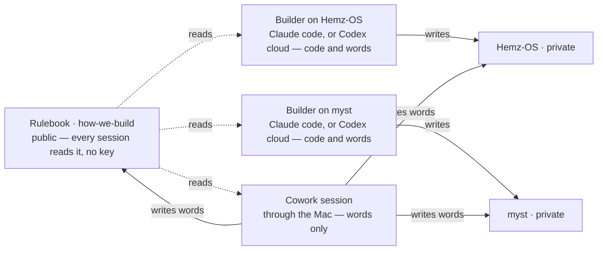

# Code and words

Scope: every session, in either stack. Open when: deciding whether a change needs a code session or can be made from Cowork.

**Code and words.** Anything that runs — code, tests, a database change, a deploy — is built in the lead's workshop, a session attached to the repo: a Claude code session, or a Codex cloud task. Only a workshop can prove it: the build, the tests, the Playwright journey on phone and desktop, the preview. Words — this rulebook, a product's `AGENTS.md`, `PRODUCT.md`, `NAMES.md`, `roadmap.json`, its screen specs, its README — may change from a Cowork session, through the Mac, by the same branch, pull request and review as everything else. Size is not the line: a one-line change to code still needs the workshop; a long change to words does not. One session reaches one product's repository — one key, one product — reads the rulebook, and writes down:

