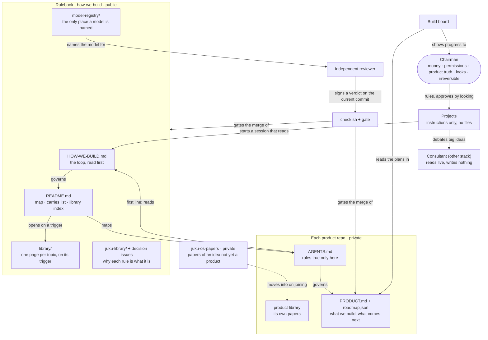

# How Juku OS fits together

Scope: the whole system. Open when: explaining how Juku OS fits together, or finding which part owns what.

One picture of every part and who owns which truth. It says where things live, never what they say: each box's own file is the rule.

**Reading it.** A session starts in a Project, which sends it to `HOW-WE-BUILD.md`, then the README. The README's map sends it to one product repo; the library opens only on a trigger. Work leaves only as a pull request: the reviewer signs a verdict on the current commit and the gate consumes it. A consensus with the consultant never stands in for that verdict. The board reads each product's plan and shows it to the Chairman, who answers only what is his.

**Who owns which truth.** How we build: this repository. What a product is and does next: its own repository. Which model does a job: `model-registry/registry.json`. Why a rule is what it is: the decision issues and `juku-library/`. Papers for an idea not yet a product: `juku-os-papers`. A Project holds instructions, never a copy of any of these.
